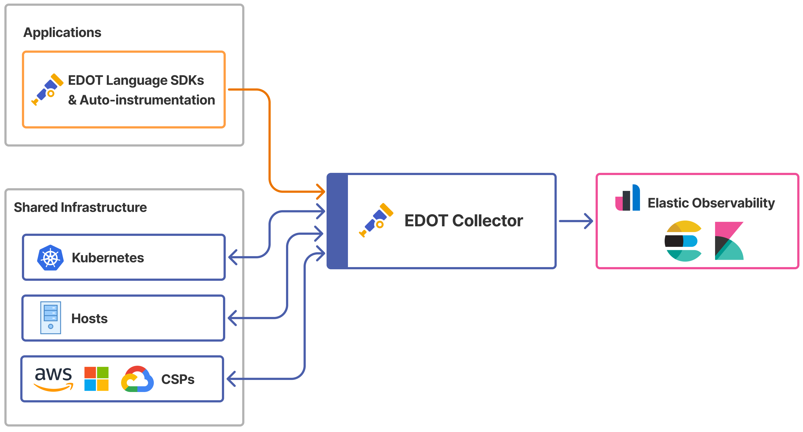

# Elastic Distributions of OpenTelemetry (EDOT)

### 🔭 What is OpenTelemetry?
[OpenTelemetry](https://opentelemetry.io/docs/) is a vendor-neutral observability framework for collecting, processing, and exporting telemetry data. If you are new to OpenTelemetry we recommended reading OpenTelemetry [concepts](https://opentelemetry.io/docs/concepts/) and [components](https://opentelemetry.io/docs/concepts/components/).

### 🇪 What is EDOT?

**Elastic Distributions of OpenTelemetry (EDOT)** is an open-source ecosystem of tailored [OpenTelemetry distributions](https://opentelemetry.io/docs/concepts/distributions/), comprising an [OpenTelemetry Collector](https://opentelemetry.io/docs/collector/) and various OpenTelemetry [Language SDKs](https://opentelemetry.io/docs/languages/).

Each EDOT distribution is asssembled with carefully curated OpenTelemetry components, then rigorously tested to ensure production readiness. This provides a reliable and optimized OpenTelemetry experience, enabling seamless adoption with confidence and expert support.

### 🗂️ Available EDOT Distributions

| EDOT Distribution | Status |
|-------------------|---------------|
| [EDOT Collector](docs/EDOT-collector/README.md) | Technical Preview |
| [EDOT Java](https://github.com/elastic/elastic-otel-java) | GA |
| [EDOT Python](https://github.com/elastic/elastic-otel-python) | Technical Preview |
| [EDOT Node.js](https://github.com/elastic/elastic-otel-node) | Technical Preview |
| [EDOT .NET](https://github.com/elastic/elastic-otel-dotnet) | Technical Preview |
| [EDOT PHP](https://github.com/elastic/elastic-otel-php) | Technical Preview |
| EDOT iOS and Android | GA |

### 🟢 Production Readiness & Support
Each EDOT distribution undergoes production-grade testing before being declared Generally Available (GA). Elastic provides full support for GA releases in accordance with our [support matrix](https://www.elastic.co/support/matrix) and SLAs.

Technical Preview distributions receive best-effort support and are not covered under standard SLAs.

### 🚀 Get Started

#### Choose Your Observability Use Case

EDOT can handle telemetry from two main sources: **Applications** and shared **Infrastructure** such as hosts or Kubernetes.

Regardless of the source, all telemetry flows through the EDOT Collector, where it is processed (where required) and exported to Elastic Observability.

Regardless of the source, all telemetry flows through the EDOT Collector, where it is processed (where required) and exported to Elastic Observability.

| **Use Case**                 | **Telemetry Type**         | **Infrastructure**        | 
**EDOT Collector**
 | 
**EDOT SDK**
 | 
**Setup EDOT**
 |
|------------------------------|---------------------------|---------------------------|:----------------------------------:|:----------------------------------:|----------------------|
| **Applications & Infrastructure** | Logs, Metrics, Traces | Kubernetes                 | ✅ | ✅ | [Quickstart](https://github.com/elastic/opentelemetry/blob/main/quickstart-guide.md#%EF%B8%8F-kubernetes---infrastructure--application--monitoring)|
| **Infrastructure Only**      | Logs, Metrics            | Kubernetes                 | ✅ | ❌ | [Quickstart](https://github.com/elastic/opentelemetry/blob/main/quickstart-guide.md#%EF%B8%8F-kubernetes---infrastructure--application--monitoring)|
| **Hosts**      | Logs, Metrics            | Host (VM, Bare Metal)      | ✅ | ❌ | [Quickstart](https://github.com/elastic/opentelemetry/blob/main/quickstart-guide.md#%EF%B8%8F-hosts-monitoring-and-log-collection) |

### 📥 Report issues or provide feedback
To report issues or provide feedback on EDOT, please [submit a github issue](https://github.com/elastic/opentelemetry/issues/new/choose).

### 📄 License
View details of license for [EDOT Collector](https://github.com/elastic/elastic-agent/blob/main/LICENSE.txt). 