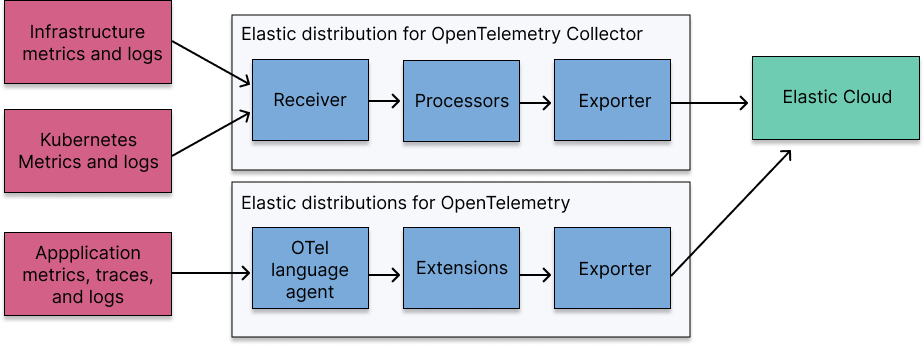

# Elastic OpenTelemetry Distributions

[OpenTelemetry](https://opentelemetry.io/docs/) is a vendor- and tool-neutral observability framework for collecting, processing, and exporting telemetry data.
You can send your telemetry data to Elastic Observability using OpenTelemetry the following ways:

- Use the **Elastic Distribution for OpenTelemetry Collector**, an extension of the [OpenTelemetry Collector](https://github.com/open-telemetry/opentelemetry-collector), to collect and send logs and host metrics to [Elastic Cloud](https://cloud.elastic.co/).
- Use the **Elastic Distributions for OpenTelemetry**, extensions of select [OpenTelemetry language SDKs](https://opentelemetry.io/docs/languages/), to instrument your applications and send logs, traces, and metrics to [Elastic Cloud](https://cloud.elastic.co/). The following languages are currently supported: Java, .NET, Node.js, and Python.
- Configure your upstream [custom collector](https://opentelemetry.io/docs/collector/custom-collector/) or [contrib](https://github.com/open-telemetry/opentelemetry-collector-contrib) distribution for the collector to collect logs and metrics and send them to Elastic Observability.

This diagram provides a quick overview on how the different components work together. Refer to the [components](docs/collector-components.md) for a more in-depth look.

## Get started with the Elastic Distribution for OpenTelemetry Collector

These pages detail the components and how to configure the Elastic Distribution for OpenTelemetry Collector ("the collector").

- [Components](docs/collector-components.md): Get details on the components used to receive, process, and export telemetry data.
- [Guided onboarding](docs/guided-onboarding.md): Use the guided onboarding in Kibana or in a serverless Observability project to send data using the collector.
- [Manual configurations](docs/manual-configuration.md): Manually configure the collector to send data to Elastic Observability.
- [Limitations](docs/collector-limitations.md): Understand the current limitations of the collector.

## Collect application data with Elastic Distributions for OpenTelemetry

Elastic offers several distributions that extend [OpenTelemetry language SDKs](https://opentelemetry.io/docs/languages/). The following languages are currently supported:

* [Java](https://github.com/elastic/elastic-otel-java)
* [.NET](https://github.com/elastic/elastic-otel-dotnet)
* [Node.js](https://github.com/elastic/elastic-otel-node)
* [Python](https://github.com/elastic/elastic-otel-python)

## Configure an upstream collector for Elastic

[Configure a custom collector or a contrib distribution of the collector](docs/configure-upstream-collector.md): Configure a [custom collector](https://opentelemetry.io/docs/collector/custom-collector/) or [contrib](https://github.com/open-telemetry/opentelemetry-collector-contrib) distribution for the collector to collect logs and metrics and send them to Elastic Observability.