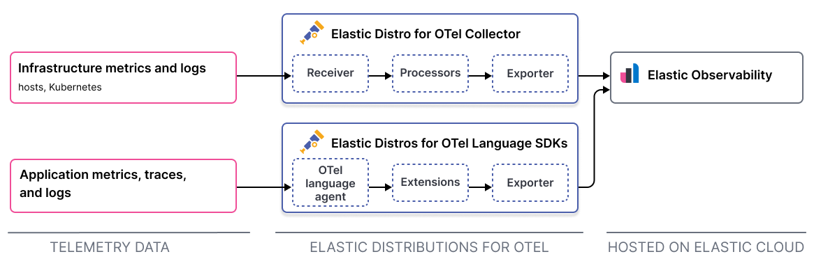

# Elastic Distributions of OpenTelemetry

[OpenTelemetry](https://opentelemetry.io/docs/) is a vendor-neutral observability framework for collecting, processing, and exporting telemetry data.

The Elastic Distributions of OpenTelemetry (EDOT) are composed of OpenTelemetry (OTel) project components, [OpenTelemetry Collector](https://github.com/open-telemetry/opentelemetry-collector), and language SDKs, which provide users with the necessary capabilities and out-of-the-box configurations, enabling quick and effortless infrastructure and application monitoring.

You can use OpenTelemetry to send your telemetry data to Elastic Observability in the following ways:

- Collect and send logs and host metrics to [Elastic Cloud](https://cloud.elastic.co/) using the EDOT Collector.
- Instrument your applications and send logs, traces, and metrics to [Elastic Cloud](https://cloud.elastic.co/) using the Elastic Distributions of select [OpenTelemetry language SDKs](https://opentelemetry.io/docs/languages/). Currently, Elastic provides distributions for the following language SDKs: Java, .NET, Node.js, and Python.
- Build and configure a [custom collector](https://opentelemetry.io/docs/collector/custom-collector/) or extend the [OpenTelemetry Collector Contrib](https://github.com/open-telemetry/opentelemetry-collector-contrib) distribution to collect logs and metrics and send them to Elastic Observability.

This diagram provides a quick overview of how the different components work together. Refer to the [components](docs/collector-components.md) for a more in-depth look.

## Collect infrastructure data using the EDOT Collector

These pages detail the components and how to configure the EDOT Collector.

- [Components](docs/collector-components.md): Get details on the components used to receive, process, and export telemetry data.
- [Guided onboarding](docs/guided-onboarding.md): Use the guided onboarding in Elasticsearch Service or a serverless Observability project to send data using the EDOT Collector.
- [Manual configurations](docs/manual-configuration.md): Manually configure the EDOT Collector to send data to Elastic Observability.
- [Limitations](docs/collector-limitations.md): Understand the current limitations of the EDOT Collector.

## Kubernetes Observability using the EDOT Collector

- [Kubernetes guided onboarding](docs/kubernetes/operator/README.md): Use the guided onboarding to send Kubernetes logs, metrics, and application traces to Elasticsearch using the EDOT Collector and [OpenTelemetry Operator](https://github.com/open-telemetry/opentelemetry-operator/).
- [Instrumenting applications](docs/kubernetes/operator/instrumenting-applications.md) on Kubernetes.

## Collect application data using the EDOT language SDKs

Elastic offers several Distributions that extend [OpenTelemetry language SDKs](https://opentelemetry.io/docs/languages/). The following languages are currently available:

* [Java](https://github.com/elastic/elastic-otel-java)
* [.NET](https://github.com/elastic/elastic-otel-dotnet)
* [Node.js](https://github.com/elastic/elastic-otel-node)
* [Python](https://github.com/elastic/elastic-otel-python)
* [PHP](https://github.com/elastic/elastic-otel-php/)

## Configure a custom collector or the OpenTelemetry Collector Contrib distribution

[Configure a custom collector or the OpenTelemetry Collector Contrib distribution](docs/configure-upstream-collector.md): Build and configure a [custom collector](https://opentelemetry.io/docs/collector/custom-collector/) or extend the [OpenTelemetry Collector Contrib](https://github.com/open-telemetry/opentelemetry-collector-contrib) distribution to collect logs and metrics and send them to Elastic Observability.
