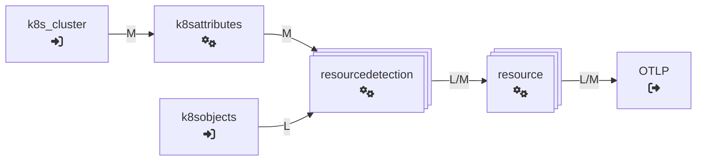
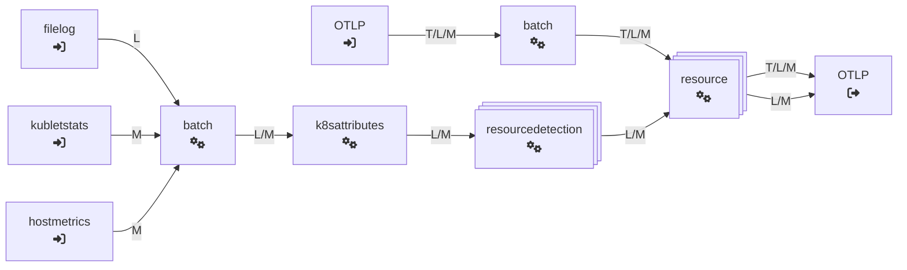
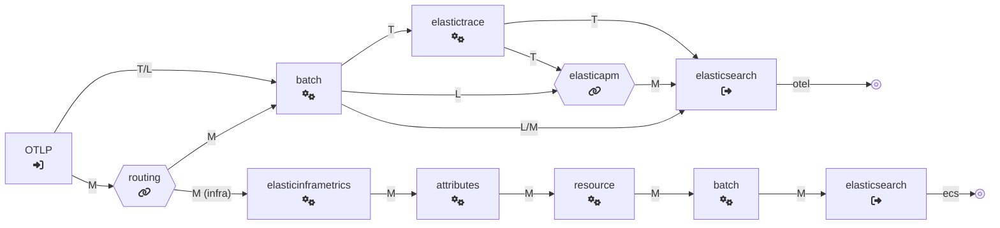
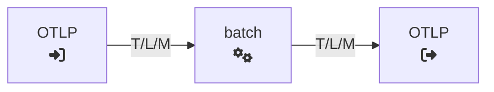

# Default Configuration - EDOT Collectors on Kubernetes
{: .no_toc }

The [Kubernetes setup](../../quickstart/index) utilizes the OpenTelemetry Operator to automate orchestration of EDOT Collectors:
 
* [EDOT Collector Cluster](#cluster-collector): Collection of cluster metrics.
* [EDOT Collector Daemon](#daemonset-collector): Collection of node metrics, logs and application telemetry.
* [EDOT Collector Gateway](#gateway-collectors): Pre-processing, aggregation and ingestion of data into Elastic.

<table>
    <thead>
        <tr>
            <td style="text-align:center;"><b>Direct ingestion into Elasticsearch</b></td>
            <td style="text-align:center;"><b>Managed OTLP Endpoint</b></td>
        </tr>
    </thead>
    <tbody>
        <tr>
            <td style="text-align:center;">
                <pre class="mermaid">
                    flowchart LR
                        cluster@{ shape: proc, label: "Cluster
                        Collector
                        fa:fa-microchip"} -->|otlp| gateway@{ shape: procs, label: "Gateway
                        Collectors
                        fa:fa-microchip"}

                        daemon@{ shape: procs, label: "Daemonset
                        Collectors
                        fa:fa-microchip"} -->|otlp| gateway

                        gateway ==>|_bulk| es@{ shape: db, label: "Elasticsearch" }

                        style es stroke:#33f,stroke-width:2px,color:#000;
                </pre>
            </td>
            <td style="text-align:center;">
                <pre class="mermaid">
                    flowchart LR
                        cluster@{ shape: proc, label: "Cluster
                        Collector
                        fa:fa-microchip"} -->|otlp| gateway@{ shape: procs, label: "Gateway
                        Collectors
                        fa:fa-microchip"}

                        daemon@{ shape: procs, label: "Daemonset
                        Collectors
                        fa:fa-microchip"} -->|otlp| gateway

                        gateway ==>|otlp| otlp@{ shape: display, label: "Managed
                        OTLP endpoint" }

                        style otlp stroke:#33f,stroke-width:2px,color:#000;
                </pre>
            </td>
        </tr>
        <tr>
            <td style="text-align:center;">
                <a href="https://raw.githubusercontent.com/elastic/elastic-agent/refs/tags/v{{ site.edot_versions.collector }}/deploy/helm/edot-collector/kube-stack/values.yaml">📄 K8s - ES</a>
            </td>
            <td style="text-align:center;">
            <a href="https://raw.githubusercontent.com/elastic/elastic-agent/refs/tags/v{{ site.edot_versions.collector }}/deploy/helm/edot-collector/kube-stack/managed_otlp/values.yaml">📄 K8s - OTLP</a>
            </td>
        </tr>
    </tbody>
</table>

The following sections describe the default pipelines for the different roles of EDOT collectors in a Kubernetes setup.

- TOC
{:toc}

## Pipeline - Cluster Collector

The main purpose of the `Cluster Collector` is to collect Kubernetes cluster-level metrics (using the [`k8s_cluster`] receiver) and cluster events ([`k8sobjects`] receiver) and forward them to the Gateway Collector through `OTLP`. The [`resource`] and [`resourcedetection`] processors enrich the cluster-level data with corresponding meta information.

## Pipeline - Daemonset Collectors

The `Daemonset Collectors` gather telemetry associated with corresponding, individual Kubernetes nodes:

1. *Host metrics and container logs*

    [`filelog`] and [`hostmetrics`] receivers are used to gather container logs and host metrics, respectively.
    The [`kubletstats`] receiver collects additional Kubernetes Node, Pod and Container metrics.
    The logs and metrics are batched for better performance ([`batch`] processor) and then enriched with meta information using the
    [`k8sattributes`], [`resourcedetection`] and [`resource`] processors.

2. *Application teleemtry through OTLP from OTel SDKs*

    The `Daemonset Collectors` also receive the application telemetry from OTel SDKs that instrument services / pods running on
    corresponding Kubernetes nodes. The Daemonset Collectors receive that data through [`OTLP`], batch the data ([`batch`] processor)
    and pass it on to the Gateway Collector through the OTLP exporter.

## Pipeline - Gateway Collectors

The `Gateway Collectors` pipelines differ fundamentally between the two different deployment use cases *'Direct ingestion into Elasticsearch'*
and using Elastic's *'Managed OTLP Endpoint'*.

### Direct ingestion into Elasticsearch

In *self-managed* and *Elastic Cloud Hosted* Stack deployment use cases the main purpose of the `Gateway Collector` is the central enrichment of data
before the OpenTelemetry data is being ingested directly into Elasticsearch using the [`elasticsearch`] exporter.

Hence, this Gateway Collector configuration comprises the pipelines for data enrichment of [application telemetry](./default-config-standalone#application--traces-collection-pipeline) and [host metrics](./default-config-standalone#host-metrics-collection-pipeline) (for details, refer to the linked descriptions of the corresponding standalone use cases).

The [`routing`] connector separates the infrastructure metrics from other metrics and routes them into the ECS-based pipeline, with ECS-compatibility exporter mode.
Other metrics are exported in OTel-native format to Elasticsearch.

### Managed OTLP Endpoint

With the managed OTLP Endpoint, the Gateway Collector configuration simply pipes all the data from the [`OTLP`] receiver through a [`batch`] processor before the data is being exported through `OTLP` to the managed endpoint.

With this scenario there's no need to do any Elastic-specific enrichment in your Kubernetes cluster, as all of that happens behind the managed OTLP endpoint.

[`hostmetrics`]: https://github.com/open-telemetry/opentelemetry-collector-contrib/tree/main/receiver/hostmetricsreceiver
[`elasticsearch`]: https://github.com/open-telemetry/opentelemetry-collector-contrib/tree/main/exporter/elasticsearchexporter
[`elasticinframetrics`]: https://github.com/elastic/opentelemetry-collector-components/tree/main/processor/elasticinframetricsprocessor
[`elasticsearch`]: https://github.com/open-telemetry/opentelemetry-collector-contrib/tree/main/exporter/elasticsearchexporter
[`k8s_cluster`]: https://github.com/open-telemetry/opentelemetry-collector-contrib/tree/main/receiver/k8sclusterreceiver
[`k8sobjects`]: https://github.com/open-telemetry/opentelemetry-collector-contrib/tree/main/receiver/k8sobjectsreceiver
[`resource`]: https://github.com/open-telemetry/opentelemetry-collector-contrib/tree/main/processor/resourceprocessor
[`k8sattributes`]: https://github.com/open-telemetry/opentelemetry-collector-contrib/tree/main/processor/k8sattributesprocessor
[`resourcedetection`]: https://github.com/open-telemetry/opentelemetry-collector-contrib/tree/main/processor/resourcedetectionprocessor
[`filelog`]: https://github.com/open-telemetry/opentelemetry-collector-contrib/tree/main/receiver/filelogreceiver
[`hostmetrics`]: https://github.com/open-telemetry/opentelemetry-collector-contrib/tree/main/receiver/hostmetricsreceiver
[`kubletstats`]: https://github.com/open-telemetry/opentelemetry-collector-contrib/tree/main/receiver/kubletstatsreceiver
[`batch`]: https://github.com/open-telemetry/opentelemetry-collector-contrib/tree/main/processor/batchprocessor
[`OTLP`]: https://github.com/open-telemetry/opentelemetry-collector/tree/main/receiver/otlpreceiver
[`routing`]: https://github.com/open-telemetry/opentelemetry-collector-contrib/tree/main/connector/routingconnector