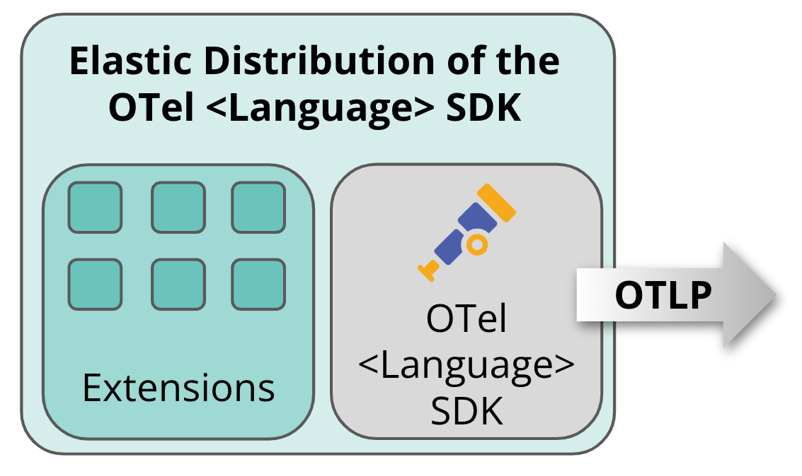

# EDOT Language SDKs

The Elastic Distributions of OpenTelemetry (EDOT) Language SDKs (aka. application agents) are thin wrappers around corresponding upstream [OpenTelemetry SDKs](https://opentelemetry.io/docs/languages/), preconfigured for best experience with Elastic Observability.
EDOT Language SDKs are fully compatible with and can be used as a drop in replacement for upstream OTel SDKs. 
In addition, EDOT SDKs provide some popular, enterprise add-on features Elastic APM users might know from classic Elastic APM agents.

Currently, the following EDOT SDKs are availble:

| EDOT SDK | Release Status |
|:-------------------|:---------------|
| [EDOT .NET](./dotnet/index) | Technical Preview |
| [EDOT Java](./java/index) | GA |
| [EDOT Node.js](./nodejs/index) | Technical Preview |
| [EDOT PHP](./php/index) | Technical Preview |
| [EDOT Python](./python/index) | Technical Preview |
| [EDOT Android](./android/index) | Technical Preview |
| [EDOT iOS](./ios/index) | GA |

For languages for which Elastic does not offer its own distribution, we recommend using the upstream OTel SDKs:

| Language | Upstream Docs |
|:-------------------|:---------------|
| JS / Browser | [Vanilla OTel RUM SDK/API](https://opentelemetry.io/docs/languages/js/) |
| Rust       | [Vanilla OTel Rust SDK/API](https://opentelemetry.io/docs/languages/rust/) |
| Ruby       | [Vanilla OTel Ruby SDK/API](https://opentelemetry.io/docs/languages/ruby/) |
| Go         | [Vanilla OTel Go SDK/API](https://opentelemetry.io/docs/languages/go/) |
| C++        | [Vanilla OTel C++ SDK/API](https://opentelemetry.io/docs/languages/cpp/)  |

## Features

<!-- 
- DO NOT DELETE THE FOLLOWING SECTION, TAGS ARE REQUIRED FOR GENERATION
- DO NOT change the following table manually, it's being generated from the features.yml file.
- supported values in features.yml are:
    - ga
    - tech-preview
    - not-available
    - not-applicable
-->
<!-- start:edot-features -->

<table class="features-table"> 
    <thead>
        <tr> 
            <th class="l" colspan="8">
                

                    
✅ generally available

                    
𝐓 in technical preview

                    
➖ not applicable

                    
❌ not available

                

            </th> 
        </tr>
        <tr> 
            <th class="f">
Feature
</th> 
            <th class="r s">
.NET 
</th> 
            <th class="r s">
Java
</th> 
            <th class="r s">
Node.js
</th> 
            <th class="r s">
PHP
</th> 
            <th class="r s">
Python
</th> 
            <th class="r s">
Android
</th> 
            <th class="r s">
iOS
</th> 
        </tr> 
    </thead> 
    <tbody>
        <!-- Feature: Distributed Tracing -->
        <tr>
            <td class="f bold"><a href="https://opentelemetry.io/docs/concepts/signals/traces/">Distributed Tracing</a></td>
            <td class="s tooltip"> <!-- .NET -->
                
✅

                
1.0+

                
'Distributed Tracing' is available in EDOT .NET since version 1.0

            </td>
            <td class="s tooltip"> <!-- Java -->
                
✅

                
1.0+

                
'Distributed Tracing' is available in EDOT Java since version 1.0

            </td>
            <td class="s tooltip"> <!-- Node.js -->
                
✅

                
1.0+

                
'Distributed Tracing' is available in EDOT Node.js since version 1.0

            </td>
            <td class="s tooltip"> <!-- PHP -->
                
✅

                
1.0+

                
'Distributed Tracing' is available in EDOT PHP since version 1.0

            </td>
            <td class="s tooltip"> <!-- Python -->
                
✅

                
1.0+

                
'Distributed Tracing' is available in EDOT Python since version 1.0

            </td>
            <td class="s tooltip"> <!-- Android -->
                
✅

                
1.0+

                
'Distributed Tracing' is available in EDOT Android since version 1.0

            </td>
            <td class="s tooltip"> <!-- iOS -->
                
✅

                
1.0+

                
'Distributed Tracing' is available in EDOT iOS since version 1.0

            </td>
        </tr>
        <!-- Feature: Service Map -->
        <tr>
            <td class="f sub"><a href="https://www.elastic.co/guide/en/observability/current/apm-service-maps.html">Service Map</a></td>
            <td class="s tooltip"> <!-- .NET -->
                
✅

                
1.0+

                
'Service Map' is available in EDOT .NET since version 1.0

            </td>
            <td class="s tooltip"> <!-- Java -->
                
✅

            </td>
            <td class="s tooltip"> <!-- Node.js -->
                
✅

            </td>
            <td class="s tooltip"> <!-- PHP -->
                
✅

                
1.0+

                
'Service Map' is available in EDOT PHP since version 1.0

            </td>
            <td class="s tooltip"> <!-- Python -->
                
✅

                
1.0+

                
'Service Map' is available in EDOT Python since version 1.0

            </td>
            <td class="s tooltip"> <!-- Android -->
                
✅

            </td>
            <td class="s tooltip"> <!-- iOS -->
                
✅

                
v1.0+

                
'Service Map' is available in EDOT iOS since version v1.0

            </td>
        </tr>
        <!-- Feature: Zero-code instrumentation -->
        <tr>
            <td class="f sub"><a href="https://opentelemetry.io/docs/concepts/instrumentation/zero-code/">Zero-code instrumentation</a></td>
            <td class="s tooltip"> <!-- .NET -->
                
✅

                
1.0+

                
'Zero-code instrumentation' is available in EDOT .NET since version 1.0

            </td>
            <td class="s tooltip"> <!-- Java -->
                
✅

                
1.0+

                
'Zero-code instrumentation' is available in EDOT Java since version 1.0

            </td>
            <td class="s tooltip"> <!-- Node.js -->
                
✅

                
1.0+

                
'Zero-code instrumentation' is available in EDOT Node.js since version 1.0

            </td>
            <td class="s tooltip"> <!-- PHP -->
                
✅

                
1.0+

                
'Zero-code instrumentation' is available in EDOT PHP since version 1.0

            </td>
            <td class="s tooltip"> <!-- Python -->
                
✅

                
1.0+

                
'Zero-code instrumentation' is available in EDOT Python since version 1.0

            </td>
            <td class="s tooltip"> <!-- Android -->
                

            </td>
            <td class="s tooltip"> <!-- iOS -->
                
❌

            </td>
        </tr>
        <!-- Feature: Head-based Sampling -->
        <tr>
            <td class="f sub"><a href="https://opentelemetry.io/docs/concepts/sampling/#head-sampling">Head-based Sampling</a></td>
            <td class="s tooltip"> <!-- .NET -->
                
✅

                
1.0+

                
'Head-based Sampling' is available in EDOT .NET since version 1.0

            </td>
            <td class="s tooltip"> <!-- Java -->
                
✅

                
1.0+

                
'Head-based Sampling' is available in EDOT Java since version 1.0

            </td>
            <td class="s tooltip"> <!-- Node.js -->
                
✅

                
1.0+

                
'Head-based Sampling' is available in EDOT Node.js since version 1.0

            </td>
            <td class="s tooltip"> <!-- PHP -->
                
❌

            </td>
            <td class="s tooltip"> <!-- Python -->
                
✅

                
1.0+

                
'Head-based Sampling' is available in EDOT Python since version 1.0

            </td>
            <td class="s tooltip"> <!-- Android -->
                

            </td>
            <td class="s tooltip"> <!-- iOS -->
                
✅

                
v1.0+

                
'Head-based Sampling' is available in EDOT iOS since version v1.0

            </td>
        </tr>
        <!-- Feature: Baggage -->
        <tr>
            <td class="f sub"><a href="https://opentelemetry.io/docs/concepts/signals/baggage/">Baggage</a></td>
            <td class="s tooltip"> <!-- .NET -->
                
✅

                
1.0+

                
'Baggage' is available in EDOT .NET since version 1.0

            </td>
            <td class="s tooltip"> <!-- Java -->
                
✅

                
1.0+

                
'Baggage' is available in EDOT Java since version 1.0

            </td>
            <td class="s tooltip"> <!-- Node.js -->
                
✅

                
1.0+

                
'Baggage' is available in EDOT Node.js since version 1.0

            </td>
            <td class="s tooltip"> <!-- PHP -->
                
✅

                
1.0+

                
'Baggage' is available in EDOT PHP since version 1.0

            </td>
            <td class="s tooltip"> <!-- Python -->
                
✅

                
1.0+

                
'Baggage' is available in EDOT Python since version 1.0

            </td>
            <td class="s tooltip"> <!-- Android -->
                

            </td>
            <td class="s tooltip"> <!-- iOS -->
                
✅

                
v1.0+

                
'Baggage' is available in EDOT iOS since version v1.0

            </td>
        </tr>
        <!-- Feature: Inferred Spans -->
        <tr>
            <td class="f sub"><a href="../edot-sdks/java/features#inferred-spans">Inferred Spans</a></td>
            <td class="s tooltip"> <!-- .NET -->
                
❌

            </td>
            <td class="s tooltip"> <!-- Java -->
                
✅

            </td>
            <td class="s tooltip"> <!-- Node.js -->
                
❌

            </td>
            <td class="s tooltip"> <!-- PHP -->
                
𝐓

                
1.0+

                
'Inferred Spans' is available in EDOT PHP since version 1.0

            </td>
            <td class="s tooltip"> <!-- Python -->
                
❌

            </td>
            <td class="s tooltip"> <!-- Android -->
                
❌

            </td>
            <td class="s tooltip"> <!-- iOS -->
                
❌

            </td>
        </tr>
        <!-- Feature: Logs Collection -->
        <tr>
            <td class="f bold"><a href="https://opentelemetry.io/docs/specs/otel/logs/#log-correlation">Logs Collection</a></td>
            <td class="s tooltip"> <!-- .NET -->
                
✅

                
1.0+

                
'Logs Collection' is available in EDOT .NET since version 1.0

            </td>
            <td class="s tooltip"> <!-- Java -->
                
✅

            </td>
            <td class="s tooltip"> <!-- Node.js -->
                
𝐓

            </td>
            <td class="s tooltip"> <!-- PHP -->
                
✅

                
1.0+

                
'Logs Collection' is available in EDOT PHP since version 1.0

            </td>
            <td class="s tooltip"> <!-- Python -->
                
𝐓

            </td>
            <td class="s tooltip"> <!-- Android -->
                

            </td>
            <td class="s tooltip"> <!-- iOS -->
                
✅

                
v1.0+

                
'Logs Collection' is available in EDOT iOS since version v1.0

            </td>
        </tr>
        <!-- Feature: Logs Correlation -->
        <tr>
            <td class="f sub"><a href="https://opentelemetry.io/docs/specs/otel/logs/#opentelemetry-solution">Logs Correlation</a></td>
            <td class="s tooltip"> <!-- .NET -->
                
✅

                
1.0+

                
'Logs Correlation' is available in EDOT .NET since version 1.0

            </td>
            <td class="s tooltip"> <!-- Java -->
                
✅

            </td>
            <td class="s tooltip"> <!-- Node.js -->
                
𝐓

            </td>
            <td class="s tooltip"> <!-- PHP -->
                
✅

                
1.0+

                
'Logs Correlation' is available in EDOT PHP since version 1.0

            </td>
            <td class="s tooltip"> <!-- Python -->
                
𝐓

            </td>
            <td class="s tooltip"> <!-- Android -->
                

            </td>
            <td class="s tooltip"> <!-- iOS -->
                
✅

                
v1.0+

                
'Logs Correlation' is available in EDOT iOS since version v1.0

            </td>
        </tr>
        <!-- Feature: Metrics Collection -->
        <tr>
            <td class="f bold"><a href="https://opentelemetry.io/docs/concepts/signals/metrics/">Metrics Collection</a></td>
            <td class="s tooltip"> <!-- .NET -->
                
✅

                
1.0+

                
'Metrics Collection' is available in EDOT .NET since version 1.0

            </td>
            <td class="s tooltip"> <!-- Java -->
                
✅

            </td>
            <td class="s tooltip"> <!-- Node.js -->
                
✅

            </td>
            <td class="s tooltip"> <!-- PHP -->
                
✅

                
1.0+

                
'Metrics Collection' is available in EDOT PHP since version 1.0

            </td>
            <td class="s tooltip"> <!-- Python -->
                
✅

                
1.0+

                
'Metrics Collection' is available in EDOT Python since version 1.0

            </td>
            <td class="s tooltip"> <!-- Android -->
                

            </td>
            <td class="s tooltip"> <!-- iOS -->
                
𝐓

                
v0.7+

                
'Metrics Collection' is available in EDOT iOS since version v0.7

            </td>
        </tr>
        <!-- Feature: Custom Metrics -->
        <tr>
            <td class="f sub">Custom Metrics</td>
            <td class="s tooltip"> <!-- .NET -->
                
✅

                
1.0+

                
'Custom Metrics' is available in EDOT .NET since version 1.0

            </td>
            <td class="s tooltip"> <!-- Java -->
                
✅

            </td>
            <td class="s tooltip"> <!-- Node.js -->
                
✅

            </td>
            <td class="s tooltip"> <!-- PHP -->
                
✅

                
1.0+

                
'Custom Metrics' is available in EDOT PHP since version 1.0

            </td>
            <td class="s tooltip"> <!-- Python -->
                
✅

                
1.0+

                
'Custom Metrics' is available in EDOT Python since version 1.0

            </td>
            <td class="s tooltip"> <!-- Android -->
                

            </td>
            <td class="s tooltip"> <!-- iOS -->
                
𝐓

                
v0.7+

                
'Custom Metrics' is available in EDOT iOS since version v0.7

            </td>
        </tr>
        <!-- Feature: Agent Health Monitoring -->
        <tr>
            <td class="f sub">Agent Health Monitoring</td>
            <td class="s tooltip"> <!-- .NET -->
                
❌

            </td>
            <td class="s tooltip"> <!-- Java -->
                
❌

            </td>
            <td class="s tooltip"> <!-- Node.js -->
                
❌

            </td>
            <td class="s tooltip"> <!-- PHP -->
                
❌

            </td>
            <td class="s tooltip"> <!-- Python -->
                
❌

            </td>
            <td class="s tooltip"> <!-- Android -->
                
❌

            </td>
            <td class="s tooltip"> <!-- iOS -->
                
❌

            </td>
        </tr>
        <!-- Feature: Runtime Metrics -->
        <tr>
            <td class="f sub"><a href="https://opentelemetry.io/docs/specs/semconv/runtime/">Runtime Metrics</a></td>
            <td class="s tooltip"> <!-- .NET -->
                
✅

                
1.0+

                
'Runtime Metrics' is available in EDOT .NET since version 1.0

            </td>
            <td class="s tooltip"> <!-- Java -->
                
✅

                
1.0+

                
'Runtime Metrics' is available in EDOT Java since version 1.0

            </td>
            <td class="s tooltip"> <!-- Node.js -->
                
𝐓

            </td>
            <td class="s tooltip"> <!-- PHP -->
                
❌

            </td>
            <td class="s tooltip"> <!-- Python -->
                
❌

            </td>
            <td class="s tooltip"> <!-- Android -->
                

            </td>
            <td class="s tooltip"> <!-- iOS -->
                
❌

            </td>
        </tr>
        <!-- Feature: Capturing Errors / Exceptions -->
        <tr>
            <td class="f bold">Capturing Errors / Exceptions</td>
            <td class="s tooltip"> <!-- .NET -->
                
✅

                
1.0+

                
'Capturing Errors / Exceptions' is available in EDOT .NET since version 1.0

            </td>
            <td class="s tooltip"> <!-- Java -->
                
✅

            </td>
            <td class="s tooltip"> <!-- Node.js -->
                
✅

            </td>
            <td class="s tooltip"> <!-- PHP -->
                
✅

                
1.0+

                
'Capturing Errors / Exceptions' is available in EDOT PHP since version 1.0

            </td>
            <td class="s tooltip"> <!-- Python -->
                
✅

                
1.0+

                
'Capturing Errors / Exceptions' is available in EDOT Python since version 1.0

            </td>
            <td class="s tooltip"> <!-- Android -->
                
✅

            </td>
            <td class="s tooltip"> <!-- iOS -->
                
✅

                
v1.0+

                
'Capturing Errors / Exceptions' is available in EDOT iOS since version v1.0

            </td>
        </tr>
        <!-- Feature: Crash Reporting -->
        <tr>
            <td class="f sub">Crash Reporting</td>
            <td class="s tooltip"> <!-- .NET -->
                
➖

            </td>
            <td class="s tooltip"> <!-- Java -->
                
➖

            </td>
            <td class="s tooltip"> <!-- Node.js -->
                
➖

            </td>
            <td class="s tooltip"> <!-- PHP -->
                
➖

            </td>
            <td class="s tooltip"> <!-- Python -->
                
➖

            </td>
            <td class="s tooltip"> <!-- Android -->
                
✅

            </td>
            <td class="s tooltip"> <!-- iOS -->
                
✅

                
v1.0+

                
'Crash Reporting' is available in EDOT iOS since version v1.0

            </td>
        </tr>
        <!-- Feature: Central Configuration -->
        <tr>
            <td class="f bold">Central Configuration</td>
            <td class="s tooltip"> <!-- .NET -->
                
❌

            </td>
            <td class="s tooltip"> <!-- Java -->
                
❌

            </td>
            <td class="s tooltip"> <!-- Node.js -->
                
❌

            </td>
            <td class="s tooltip"> <!-- PHP -->
                
❌

            </td>
            <td class="s tooltip"> <!-- Python -->
                
❌

            </td>
            <td class="s tooltip"> <!-- Android -->
                
❌

            </td>
            <td class="s tooltip"> <!-- iOS -->
                
❌

            </td>
        </tr>
        <!-- Feature: Profiling Integration -->
        <tr>
            <td class="f bold"><a href="../edot-sdks/java/features#elastic-universal-profiling-integration">Profiling Integration</a></td>
            <td class="s tooltip"> <!-- .NET -->
                
❌

            </td>
            <td class="s tooltip"> <!-- Java -->
                
𝐓

            </td>
            <td class="s tooltip"> <!-- Node.js -->
                
❌

            </td>
            <td class="s tooltip"> <!-- PHP -->
                
❌

            </td>
            <td class="s tooltip"> <!-- Python -->
                
❌

            </td>
            <td class="s tooltip"> <!-- Android -->
                
❌

            </td>
            <td class="s tooltip"> <!-- iOS -->
                
❌

            </td>
        </tr>
    </tbody> 
</table>
<!-- end:edot-features -->

## Elastic Support for EDOT SDKs

Elastic provides technical support for EDOT Language SDKs according to Elastic's [Support Policy](https://www.elastic.co/support_policy). EDOT SDKs are meant to be used in combination with the [EDOT Collector](../edot-collector/index) or Elastic's managed OTLP endpoint (on Elastic Cloud Serverless) to ingest data into Elastic solutions from the EDOT SDKs. Other ingestion paths are not officially supported by Elastic.

## License
EDOT SDKs are licensed under the [Apache License, Version 2.0](https://www.apache.org/licenses/LICENSE-2.0). 