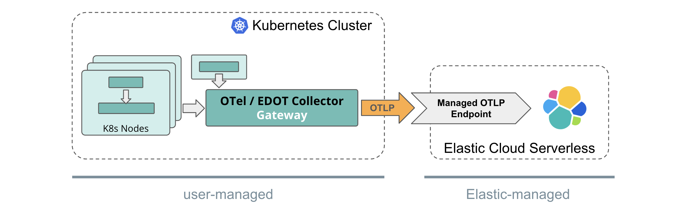

# Kubernetes Environments
{: .no_toc }

The recommended OTel architecture for Kubernetes clusters includes a set of OpenTelemetry collectors in different modes.

**OTel / EDOT Collector - Daemon**

The OTel / EDOT Collector in *Daemon mode* is deployed on each Kubernetes node to collect nodes-local logs and host metrics. 
The daemon collector also receives telemetry from applicaitons instrumented with OTel SDKs and running on corresponding nodes.
That collector enriches the application telemetry with resource information such as host and Kubernetes metadata. 
All data is then being sent through OTLP to the OTel / EDOT Gateway Collector.

**OTel / EDOT Collector - Cluster**

The OTel / EDOT Collector in *Cluster mode* collects Kubernetes cluster-level metrics and sends them to the OTel / EDOT Gateway Collector using OTLP.

**OTel / EDOT Collector - Gateway** 

The OTel / EDOT Collector in *Gateway mode* gathers the OTel data from all other collectors and ingests it into the Elastic backend.
For self-managed and Elastic Cloud Hosted deployment models the Gateway collector does some additional pre-processing of data.

See the recommended architectures per Elastic deployment scenarios:

- TOC
{:toc}

{: .note}
> Though we recommend using EDOT SDKs and EDOT Collector in the Kubernetes cluster setup (for supportability and enterprise feature reasons), it's not a technical requirement.
> Elastic's Observability solution is *technically compatible with setups that are fully based on upstream and vanilla OTel components*
> as long as the ingestion path follows the recommendations outlined in below sub-sections for the different Elastic deployment options.

## Elastic Cloud Serverless

Elastic Cloud Serverless provides a *managed OTLP endpoint* for ingestion of OpenTelemetry data. 

For a Kubernetes setup that means the *Gateway Collector* simply passes through the OTel data in native format using the OTLP protocol to the managed OTLP endpoint. In particular, there is no need for the Gateway Collector to do any Elastic-specific pre-processing. 
Though we recommend using EDOT components in your Kubernetes cluster (e.g. for supportability reasons), if desired, the OTel setup within the Kubernetes cluster can stay fully vendor agnostic.

## Elastic Cloud Hosted

With Elastic Cloud Hosted (ECH) OTel data is being directly ingested into the Elastic-hosted Elasticsearch instance.

Therefore, the *Gateway Collector* needs to do some pre-processing, aggregation of metrics and, finally, it uses the Elasticsearch exporter to ingest data into ECH. While the *Daemon* and *Cluster* collectors as well as the OTel SDKs can stay fully vendor agnostic (e.g. upstream / vanilla OTel components), the *Gateway Collector* needs to be either an EDOT Collector or a [custom, EDOT-like collector](../edot-collector/custom-collector) containing the [required components and pre-processing pipelines](../edot-collector/config/default-config-k8s#direct-ingestion-into-elasticsearch).

{: .note}
> 1. If required, users can build their custom, EDOT-like collector [following these instructions](../edot-collector/custom-collector#build-a-custom-edot-like-collector).
> 1. The EDOT Gateway Collector *does not* send data through Elastic's Integration / APM Server on ECH to ingest data into Elasticsearch.

{: .info}
> We are working on providing an Elastic-hosted OTel gateway solution for Elastic Cloud Hosted, that will eliminate the need for self-managing an EDOT Gateway Collector. Meanwhile, if self-managing an EDOT Gateway is not a valid option for you, refer to [Elastic's classic ingestion path for OTel data on ECH](https://www.elastic.co/guide/en/observability/current/apm-open-telemetry.html).

## Self-managed

With a self-managed scenario the *Gateway Collector* ingests data directly into the self-managed Elasticsearch instance.

The *Gateway Collector* does some pre-processing and aggregation of OTel data before ingesting it into Elasticsearch. While the *Daemon* and *Cluster* collectors as well as the OTel SDKs can stay fully vendor agnostic (e.g. upstream / vanilla OTel components), the *Gateway Collector* needs to be either an EDOT Collector or a [custom, EDOT-like collector](../edot-collector/custom-collector) containing the [required components and pre-processing pipelines](../edot-collector/config/default-config-k8s#direct-ingestion-into-elasticsearch).

{: .note}
> Compared to [Elastic's classic ingestion paths](https://www.elastic.co/guide/en/observability/current/apm-open-telemetry.html) for OTel data, with the EDOT Gateway Collector there is no need for an APM Server anymore.
