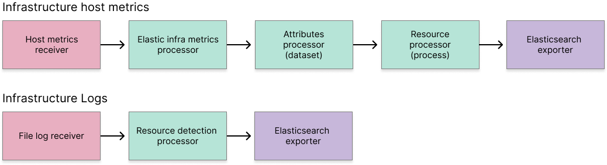
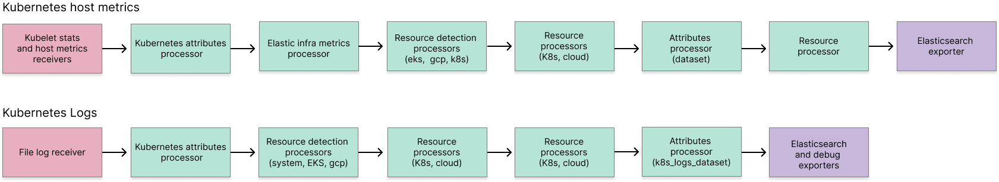

# Elastic OpenTelemetry Collector components

The OpenTelemetry Collector uses the following components to receive, process, and export telemetry data:

- [Receivers](collector-components.md#receivers): collect telemetry from your host.
- [Processors](collector-components.md#processors): modify or transform telemetry data before sending it to the exporters.
- [Exporters](collector-components.md#exporters): send data to the backends or destinations.
- [Extensions](collector-components.md#extensions): provide additional functionalities and capabilities.

The default configurations of the Elastic Distribution of the OpenTelemetry Collector follows these flows.

**MacOS and Linux logs and host metrics:**

**Kubernetes logs and host metrics:**

Refer to the following tables for more information on the components supported by the Elastic distribution of the OpenTelemetry Collector.
Follow the links for OpenTelemetry documentation with more configuration details for each component.
To set up the Elastic distribution of the OpenTelemetry collector, go to the [guided onboarding](docs/guided-onboarding.md) or [manual configuration](docs/manual-configuration.md) to get started.

## Receivers

| Component  | Description |
|---|---|
| [`filelogreceiver`](https://github.com/open-telemetry/opentelemetry-collector-contrib/blob/receiver/filelogreceiver/v0.105.0/receiver/filelogreceiver/README.md) | Collects logs from files on the local filesystem, supporting various formats and log rotation strategies. |
| [`hostmetricsreceiver`](https://github.com/open-telemetry/opentelemetry-collector-contrib/blob/receiver/hostmetricsreceiver/v0.105.0/receiver/hostmetricsreceiver/README.md) | Collects metrics from the host machine, such as CPU, memory, disk, and network usage. |
| [`httpcheckreceiver`](https://github.com/open-telemetry/opentelemetry-collector-contrib/blob/receiver/httpcheckreceiver/v0.105.0/receiver/httpcheckreceiver/README.md) | Performs HTTP checks to monitor the availability and response time of web services. |
| [`k8sclusterreceiver`](https://github.com/open-telemetry/opentelemetry-collector-contrib/blob/receiver/k8sclusterreceiver/v0.105.0/receiver/k8sclusterreceiver/README.md) | Gathers metrics and metadata from a Kubernetes cluster. |
| [`k8sobjectsreceiver`](https://github.com/open-telemetry/opentelemetry-collector-contrib/blob/receiver/k8sobjectsreceiver/v0.105.0/receiver/k8sobjectsreceiver/README.md) | Monitors changes to Kubernetes objects, and collects related metrics. |
| [`kubeletstatsreceiver`](https://github.com/open-telemetry/opentelemetry-collector-contrib/blob/receiver/kubeletstatsreceiver/v0.105.0/receiver/kubeletstatsreceiver/README.md) | Collects metrics from the Kubelet, including node and pod-level resource usage. |
| [`otlpreceiver`](https://github.com/open-telemetry/opentelemetry-collector/blob/receiver/otlpreceiver/v0.105.0/receiver/otlpreceiver/README.md) | Receives metrics, traces, and logs in OpenTelemetry Protocol (OTLP) format. |

## Processors

| Component  | Description |
|---|---|
| [`elasticinframetricsprocessor`](https://github.com/elastic/opentelemetry-collector-components/blob/processor/elasticinframetricsprocessor/v0.7.1/processor/elasticinframetricsprocessor/README.md)  | Processes infrastructure metrics to enhance and convert them for Elasticsearch. |
| [`attributesprocessor`](https://github.com/open-telemetry/opentelemetry-collector-contrib/blob/processor/attributesprocessor/v0.105.0/processor/attributesprocessor/README.md) | Modifies telemetry data attributes. |
| [`filterprocessor`](https://github.com/open-telemetry/opentelemetry-collector-contrib/blob/processor/filterprocessor/v0.105.0/processor/filterprocessor/README.md) | Filters telemetry data to include or exclude specific data points. |
| [`k8sattributesprocessor`](https://github.com/open-telemetry/opentelemetry-collector-contrib/blob/processor/k8sattributesprocessor/v0.105.0/processor/k8sattributesprocessor/README.md) | Enhances telemetry data with Kubernetes-specific metadata. |
| [`resourcedetectionprocessor`](https://github.com/open-telemetry/opentelemetry-collector-contrib/blob/processor/resourcedetectionprocessor/v0.105.0/processor/resourcedetectionprocessor/README.md) | Detects resource attributes and adds them to telemetry data. |
| [`resourceprocessor`](https://github.com/open-telemetry/opentelemetry-collector-contrib/blob/processor/resourceprocessor/v0.105.0/processor/resourceprocessor/README.md) | Allows resource attributes to be modified in telemetry data. |
| [`transformprocessor`](https://github.com/open-telemetry/opentelemetry-collector-contrib/blob/processor/transformprocessor/v0.105.0/processor/transformprocessor/README.md) | Transforms telemetry data modifying based on specified rules. |
| [`batchprocessor`](https://github.com/open-telemetry/opentelemetry-collector/blob/processor/batchprocessor/v0.105.0/processor/batchprocessor/README.md) | Batches telemetry data to improve export performance and manage load on back-end systems. |

## Exporters

| Component  | Description |
|---|---|
| [`elasticsearchexporter`](https://github.com/open-telemetry/opentelemetry-collector-contrib/blob/exporter/elasticsearchexporter/v0.105.0/exporter/elasticsearchexporter/README.md) | Sends collected telemetry data to Elasticsearch for storage and analysis. |
| [`fileexporter`](https://github.com/open-telemetry/opentelemetry-collector-contrib/blob/exporter/fileexporter/v0.105.0/exporter/fileexporter/README.md) | Writes telemetry data to a file, useful for debugging or offline analysis. |
| [`debugexporter`](https://github.com/open-telemetry/opentelemetry-collector/blob/exporter/debugexporter/v0.105.0/exporter/debugexporter/README.md) | Outputs telemetry data in a human-readable format for debugging purposes. |
| [`otlpexporter`](https://github.com/open-telemetry/opentelemetry-collector/blob/exporter/otlpexporter/v0.105.0/exporter/otlpexporter/README.md) | Sends telemetry data in OTLP format to a specified endpoint. |
| [`otlphttpexporter`](https://github.com/open-telemetry/opentelemetry-collector/blob/exporter/otlphttpexporter/v0.105.0/exporter/otlphttpexporter/README.md) | Sends telemetry data using HTTP with OTLP. |

## Extensions

| Component  | Description |
|---|---|
| [`filestorage`](https://github.com/open-telemetry/opentelemetry-collector-contrib/blob/extension/storage/filestorage/v0.105.0/extension/storage/filestorage/README.md)| Provides file-based storage for temporary data, such as checkpoints and intermediate state. |
| [`memorylimiterextension`](https://github.com/open-telemetry/opentelemetry-collector/blob/extension/memorylimiterextension/v0.105.0/extension/memorylimiterextension/README.md) | Limits the memory usage of the collector to prevent out-of-memory errors. |