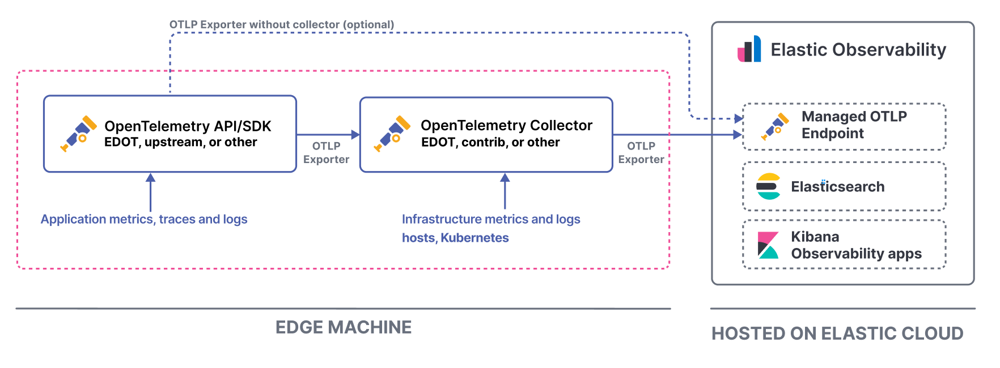
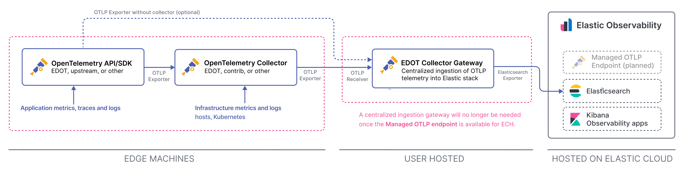
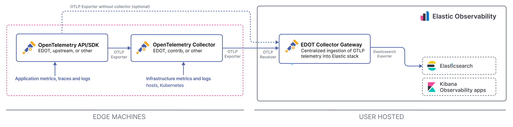

# Hosts and VMs environments

On host or virtual machine environments, deploy local, per-host OpenTelemetry Collector instances at these [edge](index.md#understanding-edge-deployment) host or VMs where your applications are running.

Collectors deployed on these edge environments have two main purposes:

1.  The collection of local logs and infrastructure metrics. Refer to [this sample config file](elastic-agent://reference/edot-collector/config/default-config-standalone.md) for recommended Collector receiver configurations for hostmetrics and logs.
2.  Enriching application telemetry from OTel SDKs with the corresponding hosts resource attributes.

:::{note}
{{product.observability}} is technically compatible with edge setups that are fully based on contrib OTel components as long as the ingestion path follows the recommendations outlined in the following sections.
:::

## Deployment scenarios

The following sections outline the recommended architectures for different Elastic deployment scenarios.

:::::{applies-switch}

::::{applies-item} serverless:
{{serverless-full}} provides a [Managed OTLP Endpoint](/reference/motlp.md) for ingestion of OpenTelemetry data.

Users can send data direct from the Collectors or SDKs deployed on the edge environment through OTLP without any additional requirements for managing an ingestion layer.
::::

::::{applies-item} ess:

:::{note}
You need an {{ech}} deployment version 9.0 or later, or version 8.19 or later.
:::

{{ech}} provides a [Managed OTLP Endpoint](/reference/motlp.md) for ingestion of OpenTelemetry data. Users can send data direct from the Collectors or SDKs deployed on the edge environment through OTLP without any additional requirements for managing an ingestion layer.

::::

::::{applies-item} { eck:, ece:, self: }
In a self-managed Elastic deployment, we recommend running an EDOT Collector in gateway mode as a unified ingestion layer for OTLP telemetry from OpenTelemetry collectors or SDKs running at the edge. This gateway can receive all signals (logs, metrics and traces), apply processing as needed, and cover the same use cases that previously required components like {{product.apm-server}} or {{product.logstash}}.

Depending on your scalability and durability needs, this can be a single collector that scales horizontally, or a chain of collectors where each tier handles a specific concern. For high availability and stronger durability guarantees, you can insert Kafka between tiers so that ingestion is buffered and resilient to downstream outages.

:::{note}
Compared to [Elastic's classic ingestion paths](docs-content://solutions/observability/apm/use-opentelemetry-with-apm.md) for OTel data, with the EDOT Collector in gateway mode there is no need for {{product.apm-server}} anymore. 

Refer to [data streams compared to classic {{product.apm}}](../compatibility/data-streams.md) for a detailed comparison of data streams, mappings, and storage models.
:::

::::

:::::