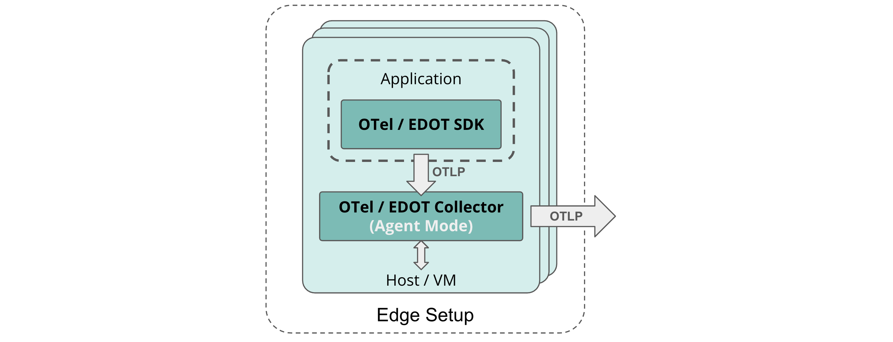

# Hosts and VMs environments

On host or virtual machine environments, deploy local, per-host OpenTelemetry Collector instances, here referred to as OTel Collector in Agent Mode.

These collectors have two main purposes:

1.  The collection of local logs and infrastructure metrics. Refer to [this sample config file](https://github.com/elastic/elastic-agent/blob/main/internal/pkg/otel/samples/linux/managed_otlp/platformlogs_hostmetrics.yml) for recommended Collector receiver configurations for hostmetrics and logs.
2.  Enriching application telemetry from OTel SDKs that run within the instrumented applications on corresponding hosts with resource information.

## Deployment scenarios [architecture-hosts-vms-deployment-scenarios]

See the recommended architectures per Elastic deployment scenarios:

:::{note}
Elastic's Observability solution is technically compatible with edge setups that are fully based on contrib OTel components as long as the ingestion path follows the recommendations outlined in the following sections.
:::

### Elastic Cloud Serverless [architecture-hosts-vms-elastic-cloud-serverless]

{{serverless-full}} provides a [Managed OTLP Endpoint](/reference/motlp.md) for ingestion of OpenTelemetry data.

Users can send their OTel data from the edge setup in OTel-native format through OTLP without any additional requirements for self-managed preprocessing of data.

### Elastic Cloud Hosted [architecture-hosts-vms-elastic-cloud-hosted]

As of Elastic Stack version 9.0 on {{ech}} (ECH), you need to run a self-hosted EDOT Collector in Gateway Mode to ingest OTel data from the edge setup in OTel-native format into the Elastic-hosted {{es}}.

The EDOT Collector in Gateway mode enriches and pre-aggregates the data for a seamless experience in the Elastic Observability solution before ingesting it directly into {{es}}.

If required, users can build their custom, EDOT-like Collector
[following these instructions](/reference/edot-collector/custom-collector.md).

:::{note}
The EDOT Gateway Collector does not send data through Elastic's Integration / APM Server on ECH to ingest data into {{es}}.
:::

:::{important}
If self-managing an EDOT Gateway is not a valid option for you, refer to [Elastic's classic ingestion path for OTel data on ECH](docs-content://solutions/observability/apm/use-opentelemetry-with-apm.md).
:::

### Self-managed [architecture-hosts-vms-self-managed]

In a self-managed deployment scenario, you need to host an EDOT Collector in Gateway mode that pre-processes and ingests OTel data from the edge setup into the self-managed Elastic Stack.

:::{note}
Compared to [Elastic's classic ingestion paths](docs-content://solutions/observability/apm/use-opentelemetry-with-apm.md) for OTel data, with the EDOT Gateway Collector there is no need for an APM Server anymore. 

Refer to [EDOT data streams compared to classic APM](../compatibility/data-streams.md) for a detailed comparison of data streams, mappings, and storage models.
:::