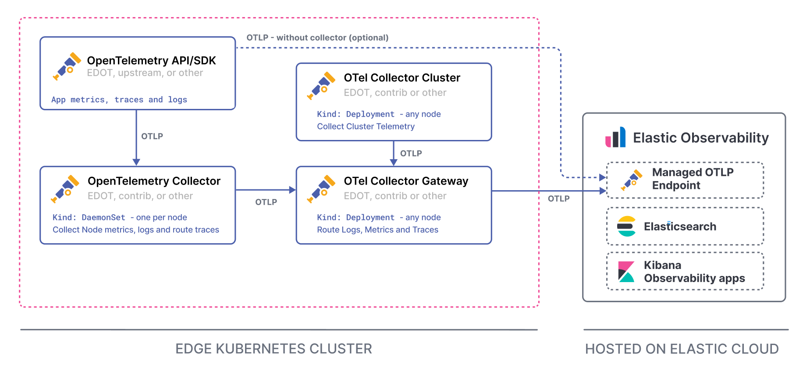
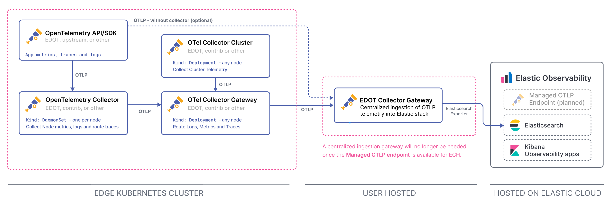
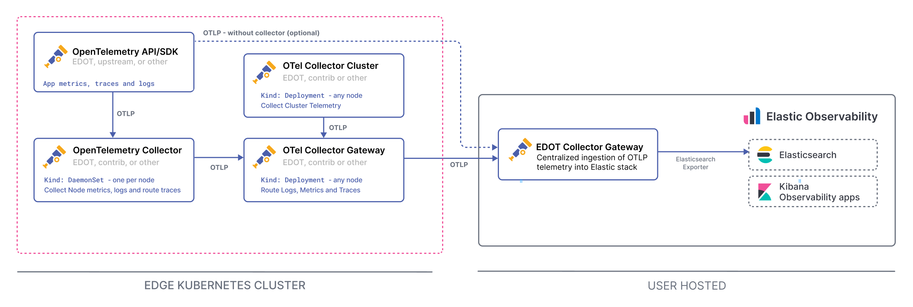

# Kubernetes environments

## Types of collectors

The recommended OTel architecture for Kubernetes clusters includes a set of OpenTelemetry collectors in different forms.

### DaemonSet collectors

The Collector as a DaemonSet resource kind, deploys an instance on each Kubernetes node as an [edge collector](index.md#understanding-edge-deployment) (close to your data sources) to collect node-local logs and host metrics.

The DaemonSet collectors also can funnel and enrich telemetry from applications instrumented with OTel SDKs and running on corresponding nodes.

That Collector enriches the application telemetry with resource information such as host and Kubernetes metadata.

All data is then sent through OTLP to the gateway Collector running in the cluster.

### Cluster collector

The Cluster collector is a Deployment resource kind that collects Kubernetes cluster-level metrics and sends them to the gateway Collector using OTLP.

This instance of the collector helps with collecting cluster level metrics which otherwise would be duplicated by the DaemonSet instances.

### Gateway collector (on edge)

The gateway Collector deployed in the Kubernetes cluster centralizes OTel data from the DaemonSet and Cluster collectors. This gateway collector runs as part of your edge environment, not as part of the Elastic backend. It can be any OpenTelemetry Collector distribution as long as it forwards data using OTLP to the appropriate backend endpoint:

- For {{serverless-full}} and {{ech}}: Sends OTLP data to the Managed OTLP Endpoint.
- For self-managed, ECE, and ECK: Sends OTLP data to an EDOT Collector running in gateway mode on the backend side (refer to [backend architecture](index.md#understanding-the-elastic-observability-backend)).

## Deployment scenarios

The following sections outline the recommended architectures for different Elastic deployment scenarios.

::::{note}
{{product.observability}} is technically compatible with setups that are fully based on contrib OTel components, as long as the ingestion path follows the recommendations outlined in following sections for the different Elastic deployment options.
::::

### {{serverless-full}}

{{serverless-full}} provides a [Managed OTLP Endpoint](/reference/motlp.md) for ingestion of OpenTelemetry data.



For a Kubernetes setup, the gateway Collector in your cluster sends OTLP data directly to the Managed OTLP Endpoint. There is no need for an EDOT gateway collector on the backend side. You can optionally deploy an EDOT Collector in gateway mode as part of your edge environment if you need additional processing before data reaches the Managed OTLP Endpoint.

### {{ech}}
```{applies_to}
ess:
stack: preview 9.2
```

{{ech}} provides a [Managed OTLP Endpoint](/reference/motlp.md) for ingestion of OpenTelemetry data.

For a Kubernetes setup, the gateway Collector in your cluster sends OTLP data directly to the Managed OTLP Endpoint. There is no need for an EDOT gateway collector on the backend side.



### Self-managed
```{applies_to}
product: ga 2.3.0
```

With a self-managed deployment, you need an EDOT Collector running in gateway mode as part of your {{product.observability}} backend (not in the Kubernetes cluster). This backend gateway collector receives OTLP data from the Kubernetes gateway collector and ingests it into {{es}}.



The backend gateway Collector processes {{product.apm}} data and logs to improve latency on solution UIs before ingesting into {{es}}.

The Kubernetes cluster components (DaemonSet collectors, Cluster collectors, gateway collector, and OTel SDKs) can all use fully vendor-agnostic or upstream OpenTelemetry components. Only the backend gateway Collector needs to be either an EDOT Collector or a [custom, EDOT-like Collector](elastic-agent://reference/edot-collector/custom-collector.md) containing the [required components and preprocessing pipelines](elastic-agent://reference/edot-collector/config/default-config-k8s.md#direct-ingestion-into-elasticsearch).

::::{note}
Compared to [Elastic's classic ingestion paths](docs-content://solutions/observability/apm/use-opentelemetry-with-apm.md) for OTel data, with the EDOT gateway Collector there is no need for {{product.apm-server}} anymore.

Refer to [EDOT data streams compared to classic {{product.apm}}](../compatibility/data-streams.md) for a detailed comparison of data streams, mappings, and storage models.
::::
