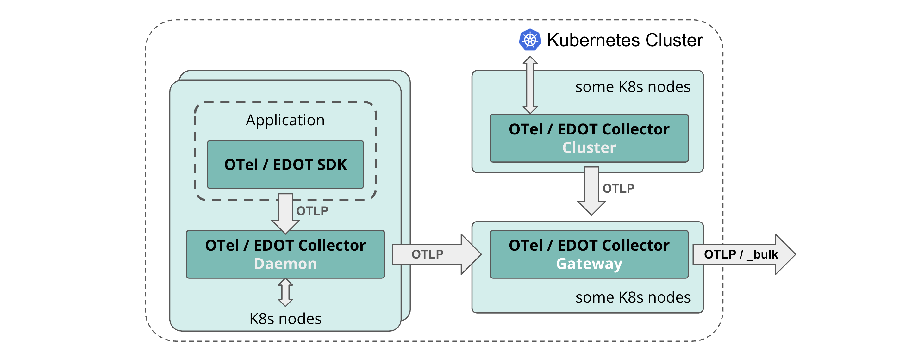
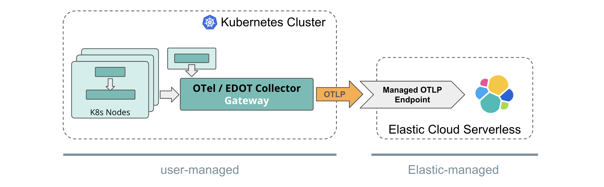

# Kubernetes Environments

The recommended OTel architecture for Kubernetes clusters includes a set of OpenTelemetry collectors in different forms. The following diagram shows the different forms:

## Daemon form

The Collector in Daemon form is deployed on each Kubernetes node to collect nodes-local logs and host metrics.

The daemon collector also receives telemetry from applications instrumented with OTel SDKs and running on corresponding nodes.

That Collector enriches the application telemetry with resource information such as host and Kubernetes metadata.

All data is then being sent through OTLP to the OTel or EDOT Gateway Collector.

## Cluster form

The Collector in Cluster form collects Kubernetes cluster-level metrics and sends them to the OTel or EDOT Gateway Collector using OTLP.

## Gateway form

The OTel or EDOT Collector in Gateway form gathers the OTel data from all other collectors and ingests it into the Elastic backend.

For self-managed and {{ech}} deployment models the Gateway Collector does some additional pre-processing of data.

## Deployment scenarios

See the recommended architectures per Elastic deployment scenarios:

::::{note}
Elastic's Observability solution is technically compatible with setups that are fully based on contrib OTel components, as long as the ingestion path follows the recommendations outlined in following sub-sections for the different Elastic deployment options.
::::

### Elastic Cloud Serverless

{{serverless-full}} provides a [Managed OTLP Endpoint](/reference/motlp.md) for ingestion of OpenTelemetry data.

For a Kubernetes setup, that means the Gateway Collector passes through the OTel data in native format using the OTLP protocol to the managed OTLP endpoint. There is no need for the Gateway Collector to do any Elastic-specific pre-processing.

### Elastic Cloud Hosted

With {{ech}} (ECH), OTel data is being directly ingested into the Elastic-hosted {{es}} instance.

The Gateway Collector needs to do some preprocessing, aggregation of metrics and, finally, it uses the {{es}} exporter to ingest data into ECH.

While the Daemon and Cluster collectors, as well as the OTel SDKs, can stay fully vendor agnostic or upstream, the Gateway Collector needs to be either an EDOT Collector or a [custom, EDOT-like Collector](elastic-agent://reference/edot-collector/custom-collector.md) containing the
[required components and pre-processing pipelines](elastic-agent://reference/edot-collector/config/default-config-k8s.md#direct-ingestion-into-elasticsearch).

If required, users can build their custom, EDOT-like Collector [following these instructions](elastic-agent://reference/edot-collector/custom-collector.md).

::::{note}
The EDOT Gateway Collector does not send data through Elastic's Integration / APM Server on ECH to ingest data into {{es}}.
::::

::::{important}
If self-managing an EDOT Gateway is not a valid option for you, refer to [Elastic's classic ingestion path for OTel data on ECH](docs-content://solutions/observability/apm/use-opentelemetry-with-apm.md).
::::

### Self-managed

With a self-managed scenario the Gateway Collector ingests data directly into the self-managed {{es}} instance.

The Gateway Collector does some preprocessing and aggregation of OTel data before ingesting it into {{es}}.

While the Daemon and Cluster collectors, as well as the OTel SDKs, can stay fully vendor agnostic or upstream, the Gateway Collector needs to be either an EDOT Collector or a [custom, EDOT-like Collector](elastic-agent://reference/edot-collector/custom-collector.md) containing the [required components and pre-processing pipelines](elastic-agent://reference/edot-collector/config/default-config-k8s.md#direct-ingestion-into-elasticsearch).

::::{note}
Compared to [Elastic's classic ingestion paths](docs-content://solutions/observability/apm/use-opentelemetry-with-apm.md) for OTel data, with the EDOT Gateway Collector there is no need for an APM Server anymore.

Refer to [EDOT data streams compared to classic APM](../compatibility/data-streams.md) for a detailed comparison of data streams, mappings, and storage models.
::::
