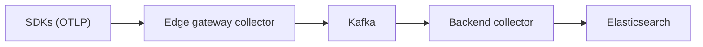
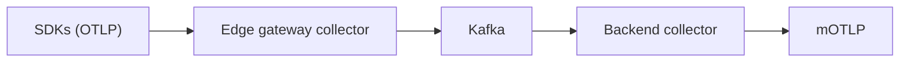

# Kafka-based ingest pipelines with EDOT [kafka-ingest-pipelines-edot]

Kafka can act as a transport buffer between telemetry sources (applications and edge collectors) and your backend, decoupling production from ingestion. Use this pattern when you need buffering during outages or maintenance, independent scaling of collection and ingestion, or a shared transport layer across environments or networks.

In this pipeline, the collector that receives OTLP and produces to Kafka runs at the edge (the producer side). It is not the same as the [Gateway Collector](index.md#understanding-the-elastic-observability-backend) that serves as the backend ingestion layer in direct-ingestion architectures. This doc uses "edge gateway collector" for the producer-side collector and "backend collector" for the consumer-side collector that sends data to {{es}} or mOTLP.

## Reference architectures [reference-architectures]

The following patterns cover self-managed {{es}} and {{ecloud}} using the {{motlp}}.

### Self-managed (on-prem) {{es}} [self-managed-elasticsearch]

The pipeline flows as follows:



In this model:
- An edge gateway collector receives OTLP from applications (for example, EDOT SDKs or other OTLP-compatible SDKs) and exports OTLP payloads to Kafka.
- An EDOT backend collector consumes OTLP payloads from Kafka and exports to {{es}}.

### {{ecloud}} (Hosted/Serverless) using mOTLP [elastic-cloud-motlp]

The pipeline flows as follows:



In this model:
- An EDOT backend collector consumes OTLP payloads from Kafka and exports to the {{ecloud}} Managed OTLP endpoint (mOTLP) using the OTLP/HTTP exporter.

## Components [components]

These pipelines rely on the following EDOT Collector components:
- `kafkaexporter` to write OTLP payloads to Kafka.
- `kafkareceiver` to read OTLP payloads from Kafka.

For EDOT, only the `otlp_proto` and `otlp_json` encodings are supported for the Kafka receiver and exporter. Partitioning options (for example, `partition_traces_by_id`) are not supported. Refer to the [EDOT Collector components list](elastic-agent://reference/edot-collector/components.md) for the full list and support notes.

## Example configuration [example-configuration]

The following examples show a minimal split deployment for:
- Edge gateway collector (produces to Kafka)
- Backend collector (consumes from Kafka and exports to {{es}} or mOTLP)

:::{note}
Use an OTLP encoding on Kafka (for example, `otlp_proto`). Ensure the receiver and exporter use the same encoding and topics.
:::

### Edge gateway collector [edge-gateway-collector]

This example receives OTLP and exports to Kafka.

```yaml
receivers:
  otlp:
    protocols:
      grpc:
      http:

exporters:
  kafka:
    brokers: ["kafka1:9092", "kafka2:9092", "kafka3:9092"]
    logs:
      topic: "otel-otlp"
      encoding: otlp_proto
    metrics:
      topic: "otel-otlp"
      encoding: otlp_proto
    traces:
      topic: "otel-otlp"
      encoding: otlp_proto

service:
  pipelines:
    traces:
      receivers: [otlp]
      exporters: [kafka]
    metrics:
      receivers: [otlp]
      exporters: [kafka]
    logs:
      receivers: [otlp]
      exporters: [kafka]
```

### Backend collector for self-managed [backend-collector-self-managed]

This example receives from Kafka and exports to {{es}}.

```yaml
receivers:
  kafka:
    brokers: ["kafka1:9092", "kafka2:9092", "kafka3:9092"]
    logs:
      topics: ["otel-otlp"]
      encoding: otlp_proto
    metrics:
      topics: ["otel-otlp"]
      encoding: otlp_proto
    traces:
      topics: ["otel-otlp"]
      encoding: otlp_proto

exporters:
  elasticsearch:
    endpoints: ["https://elasticsearch.example:9200"]
    api_key: "${ELASTICSEARCH_API_KEY}"

service:
  pipelines:
    traces:
      receivers: [kafka]
      exporters: [elasticsearch]
    metrics:
      receivers: [kafka]
      exporters: [elasticsearch]
    logs:
      receivers: [kafka]
      exporters: [elasticsearch]
```

### Backend collector for {{ecloud}} [backend-collector-motlp]

This example receives from Kafka and exports to {{motlp}}. The {{motlp}} endpoint uses the OTLP/HTTP protocol, so the configuration uses the `otlphttp` exporter to send to the HTTPS endpoint correctly.

```yaml
receivers:
  kafka:
    brokers: ["kafka1:9092", "kafka2:9092", "kafka3:9092"]
    logs:
      topics: ["otel-otlp"]
      encoding: otlp_proto
    metrics:
      topics: ["otel-otlp"]
      encoding: otlp_proto
    traces:
      topics: ["otel-otlp"]
      encoding: otlp_proto

exporters:
  otlphttp:
    endpoint: "${MOTLP_ENDPOINT}"
    headers:
      Authorization: "ApiKey ${MOTLP_API_KEY}"

service:
  pipelines:
    traces:
      receivers: [kafka]
      exporters: [otlphttp]
    metrics:
      receivers: [kafka]
      exporters: [otlphttp]
    logs:
      receivers: [kafka]
      exporters: [otlphttp]
```

## Operational notes [operational-notes]

Monitor backpressure and export failures on both the edge gateway collector and the backend collector. A Kafka buffer can mask downstream ingestion problems until retention is exhausted. To avoid it, size retention and partitions for peak ingest and expected outage windows. 

For {{product.apm}} UI optimizations on self-managed backends, align the backend collector's mode and processors with the recommended EDOT gateway architecture for your deployment.