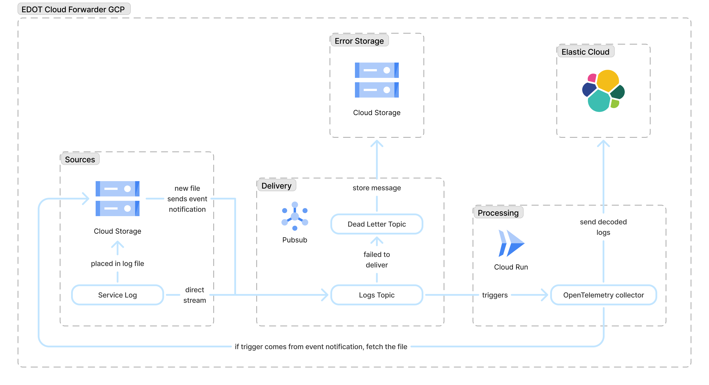

# EDOT Cloud Forwarder for GCP

{{edot-cf}} for GCP provides a serverless, scalable way to ingest Google Cloud Platform logs into Elastic. It deploys the EDOT Collector as a Google Cloud Run service that listens for Pub/Sub push subscriptions, processes the logs, and forwards them to {{motlp}}.

## Architecture overview

The architecture for the {{edot-cf}} GCP is as pictured:

### Data flow

- Ingestion: Logs are sent to a Pub/Sub topic (either directly or using a GCS bucket notification).
- Processing: A push subscription triggers the Cloud Run service, where an OpenTelemetry Collector is running.
- Forwarding: The service processes the data and exports it to {{ecloud}} using the {{motlp}}.
- Failure handling: If processing or forwarding still fails after retries, the failed messages are routed to a dead-letter topic and archived in a GCS bucket for future analysis.

## Supported log types

Currently, {{edot-cf}} for GCP supports the following log types:

| Log             | OTel mapping    |
|-----------------|-----------------|
| Cloud Audit Log | Cloud Audit Log |
| VPC Flow Log    | Access logs     |

:::{note}
We are working to support other popular log types and sources. [Contact us](docs-content://troubleshoot/ingest/opentelemetry/contact-support.md) to let us know of any specific requirements that could influence our plans.
:::

## Prerequisites

### Elastic requirements

- Access to {{motlp}} endpoint.
- Valid API key with ingest permissions.

You can refer to [Send data to Elastic](../motlp.md#send-data-to-elastic) documentation for more details.

### GCP permissions

You should have the following permissions on your Google Cloud project:

:::{dropdown} Project IAM Admin
The principal should be granted the built-in `roles/resourcemanager.projectIamAdmin` role, allowing them to manage IAM policies and roles at the project level.
:::

:::{dropdown} Storage
The following permissions are needed for Cloud Storage management: 
- `storage.buckets.create` 
- `storage.buckets.delete` 
- `storage.buckets.get` 
- `storage.buckets.getIamPolicy`
- `storage.buckets.setIamPolicy`
- `storage.buckets.update`
:::

:::{dropdown} Secret Manager
The following permissions are needed for Secret Manager management: 
- `secretmanager.secrets.create` 
- `secretmanager.secrets.delete` 
- `secretmanager.secrets.get` 
- `secretmanager.secrets.getIamPolicy` 
- `secretmanager.secrets.setIamPolicy` 
- `secretmanager.secrets.update` 
- `secretmanager.versions.access` 
- `secretmanager.versions.add` 
- `secretmanager.versions.destroy` 
- `secretmanager.versions.enable` 
- `secretmanager.versions.get` 
:::

:::{dropdown} Pub/Sub
The following permissions are needed for Pub/Sub management: 
- `pubsub.subscriptions.create` 
- `pubsub.subscriptions.delete` 
- `pubsub.subscriptions.get` 
- `pubsub.subscriptions.getIamPolicy` 
- `pubsub.subscriptions.list` 
- `pubsub.subscriptions.setIamPolicy` 
- `pubsub.subscriptions.update` 
- `pubsub.topics.attachSubscription` 
- `pubsub.topics.create` 
- `pubsub.topics.delete` 
- `pubsub.topics.detachSubscription` 
- `pubsub.topics.get` 
- `pubsub.topics.getIamPolicy` 
- `pubsub.topics.setIamPolicy` 
- `pubsub.topics.update` 
:::

:::{dropdown} Cloud Run
The following permissions are needed for Cloud Run management: 
- `run.operations.get` 
- `run.services.create` 
- `run.services.delete` 
- `run.services.get` 
- `run.services.getIamPolicy` 
- `run.services.setIamPolicy` 
- `run.services.update` 
:::

:::{dropdown} Service Account
The following permissions are needed for Service Account management: 
- `iam.serviceAccountKeys.create` 
- `iam.serviceAccountKeys.get` 
- `iam.serviceAccounts.create` 
- `iam.serviceAccounts.delete` 
- `iam.serviceAccounts.get` 
- `iam.serviceAccounts.update` 
- `iam.serviceAccounts.actAs` 
:::

:::{dropdown} Artifact Registry
The following permissions are needed: 
- `artifactregistry.repositories.create` 
- `artifactregistry.repositories.delete` 
- `artifactregistry.repositories.get` 
- `artifactregistry.repositories.getIamPolicy` 
- `artifactregistry.repositories.setIamPolicy` 
- `artifactregistry.repositories.update` 
- `artifactregistry.repositories.downloadArtifacts` 
:::

## Quick start

You can deploy {{edot-cf}} for GCP using the Terraform module...

% TODO Publish https://github.com/elastic/terraform-google-edot-cloud-forwarder on terraform public registry
% Issue: https://elasticco.atlassian.net/browse/ENGPRD-1866

## Features

The {{edot-cf}} is engineered for high-throughput, reliable ingestion, and simplified observability.

### Flexible ingestion

The {{edot-cf}} supports two primary event-driven ingestion patterns on GCP:
- Direct Pub/Sub: Ideal for logs streamed directly to a Pub/Sub topic by custom applications or other GCP services.
- GCS file notifications: Automatically ingests batch logs (like VPC Flow Logs or Audit Logs) placed in a file into a Google Cloud Storage bucket. The system listens for the `OBJECT_FINALIZE` event, reads the file content, and processes it.

### Reliability

Reliability is built-in to prevent data loss or infinite retry loops.
- Message acknowledgment: The service only acknowledges (ACKs) a Pub/Sub message upon successful forwarding to Elastic, ensuring that failed messages are automatically placed back in the queue for retry (or sent to the dead letter topic).
- Smart retries: The underlying Pub/Sub subscription is configured with exponential backoff. This prevents overwhelming the service with repeated failed messages during transient issues like network instability.
- Dead letter topic and failure bucket: If a message fails to be processed or forwarded after the configured maximum number of attempts, the {{edot-cf}} guarantees the message is sent to the dead letter topic. Messages sent to the dead letter topic are later archived in a dedicated GCS bucket. This prevents data loss and allows for later inspection.

### Observability and data enrichment

The {{edot-cf}} provides detailed context about its own health and the data it processes.
- Self-telemetry: You can enable the OpenTelemetry collector's internal metrics, allowing you to monitor the service's health.
- Metadata enrichment: By enabling the `include_metadata` option, logs are automatically enriched with context from the Pub/Sub and GCS transport layers, enabling better troubleshooting and correlation:
  - `bucket` and `object`, for logs coming from a GCS bucket.
  - `subscription` and `message_id`.
  - delivery_attempt, useful for tracking retries.

% Best effort, maybe not present for Tech Preview
% ## Performance
% TODO

## Limitations

The current retry logic treats all failures the same way, whether they're temporary or permanent errors like an invalid log format. This means a message that can't ever be processed correctly will still go through all configured retries before finally being sent to the dead-letter topic and archived in the GCS bucket. While this ensures resilience against transient failures, it does mean you might incur unnecessary processing costs for messages that were never going to succeed.
