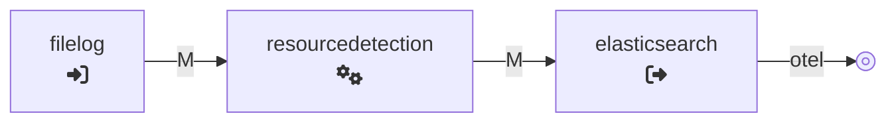
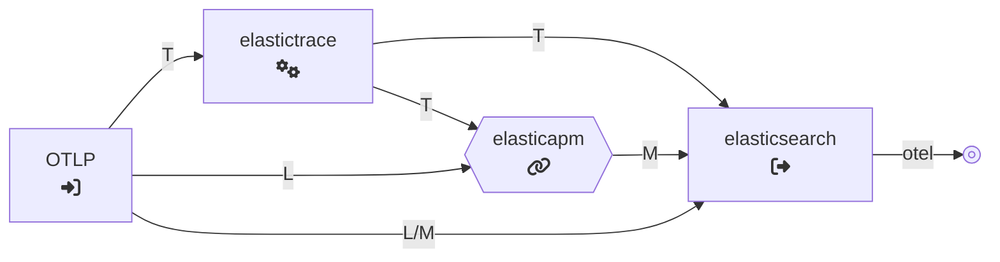
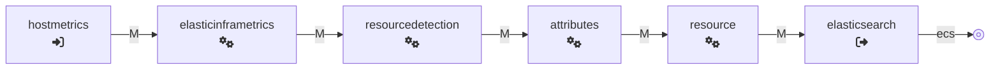
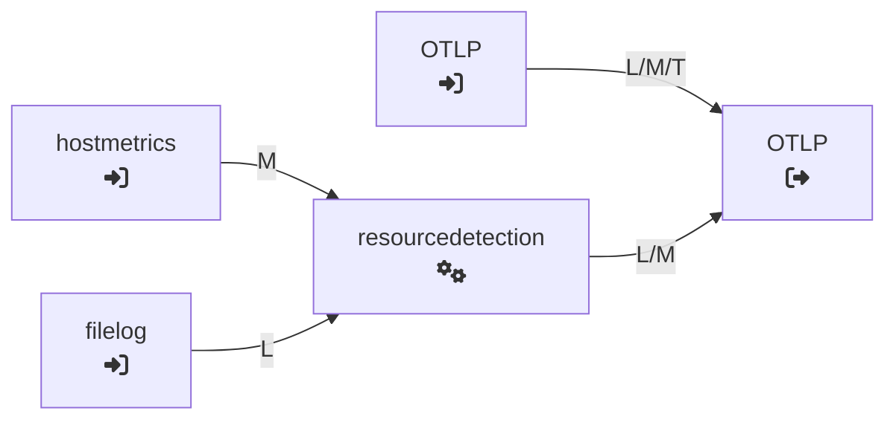

# Default Configuration - Standalone EDOT Collector

The standalone EDOT Collector comes with a default configuration that covers pipelines for the collection of logs, host metrics and data from OTel SDKs.
The following sampling files are available:

| Use Cases | Direct ingestion into Elasticsearch | Managed OTLP Endpoint |
|---|---|---|
| Platform logs | [📄 Logs - ES] | [📄 Logs - OTLP] |
| Platform logs & host metrics | [📄 Logs &#124; Metrics - ES] | [📄 Logs &#124; Metrics - OTLP] |
| Platform logs, host metrics, application telemetry | [📄 Logs &#124; Metrics &#124; App - ES] (*default*) | [📄 Logs &#124; Metrics &#124; App - OTLP] (*default*) |

Use the above example configurations as a reference when configuring your upstream collector or customizing your EDOT Collector configuration.

The following sections describe the pipelines of the above configurations split down by single use cases.

## Direct Ingestion into Elasticsearch

For *self-managed* and *Elastic Cloud Hosted* Stack deployment use cases (as of Elastic Stack version <COLLECTOR_VERSION>), we recommend ingesting OpenTelemetry data
from the EDOT Collector directly into Elasticsearch using the [`elasticsearch`] exporter.

Learn more about the configuration options for the `elasticsearch` exporter in the [corresponding documentation](https://github.com/open-telemetry/opentelemetry-collector-contrib/blob/main/exporter/elasticsearchexporter/README.md#configuration-options) or learn about [common configuration use cases](./configure-data-ingestion) for the `elasticsearch` exporter.

The `elasticsearch` exporter comes with two relevant data ingestion modes:

- **`ecs`**: Writes data in backwards compatible ECS format. Original attribute names and semantics may get lost in translation.
- **`otel`**: OTel attribute names and semantics are preserved.

Overall, the goal of EDOT is to preserve OTel data formats and semantics as much as possible, hence, `otel` is the default mode for the EDOT Collector.
However, some use cases might require data to be exported in ECS format for backwards compatibility reasons.

### Logs Collection Pipeline

For log collection, the default configuration utilizes the [`filelog`] receiver to read log entries from files. 

In addition, the [`resourcedetection`] processor enriches the log entries with meta information about the corresponding host and operating system.

Data is written out directly into Elasticsearch with the [`elasticsearch`] exporter using the `OTel-native` data mode.

### Application / Traces Collection Pipeline

The application pipeline in the EDOT Collector receives data from OTel SDKs through the [`OTLP`] receiver. While logs and metrics are exported as is into Elasticsearch, traces involve two additional processors / connectors.

The [`elastictrace`] processor enriches trace data with additional attributes that improve the user experience in the Elastic Observability UIs. In addition, the [`elasticapm`] connector generates pre-aggregated APM metrics from tracing data.

:::{note}
> Both components, `elastictrace` and `elasticapm` are required for Elastic APM UIs to work properly. However, both components are not (yet) included in the OpenTelemetry [Collector Contrib repository](https://github.com/open-telemetry/opentelemetry-collector-contrib). Thus, to use OpenTelemetry with Elastic for APM use cases one of the following options is available:
>
> * use the EDOT Collector with that configuration to ingest data into Elasticsearch
> * **or** [build a custom, EDOT-like ](../custom-collector) for ingesting data into Elasticsearch
> * **or** use Elastic's [managed OTLP endpoint](../../quickstart/serverless/index) that would do the enrichment for you
:::

Application-related OTel data is ingested into Elasticsearch in OTel-native format using the [`elasticsearch`] exporter.

### Host Metrics Collection Pipeline

This pipeline utilizes the [`hostmetrics`] receiver to collect `disk`, `filesystem`, `cpu`, `memory`, `process` and `network` metrics for the corresponding host.

For backwards compatibility host metrics are translated into ECS-compatible system metrics using the [`elasticinframetrics`] processor and, finally, are ingested in `ecs` format through the [`elasticsearch`] exporter.

The [`resourcedetection`] processor enriches the metrics with meta information about the corresponding host and operating system.
The [`attributes`] and [`resource`] processor are used to set some fields for proper routing of the ECS-based system metrics data into corresponding Elasticsearch data streams.

## Ingestion through the Managed OTLP Endpoint

When ingesting OTel data through Elastics Managed OTLP endpoint, all the enrichment that is required for an optimal experience in the Elastic solutions is happening behind the
managed OTLP endpoint and, thus, is transparent to the users. 

Accordingly, the collector configuration for all the use cases is relatively simple and is only about local data collection and context enrichment:

Platform logs are scraped with the [`filelog`] receiver, host metrics are collected through the [`hostmetrics`] receiver and both signals are enriched with meta information through the [`resourcedetection`] processor.

Data from OTel SDKs is piped through the [`OTLP`] receiver directly to the OTLP exporter that sends data for all the signals to the managed OTLP endpoint.

As you can see, with the managed OTLP Endpoint there is no need for configuring any Elastic-specific components, such as [`elasticinframetrics`], [`elastictrace`] processors, [`elasticapm`] connector or the [`elasticsearch`] exporter. Hence, with this deployment model the edge setup and configuration can be 100% vendor agnostic.

[`attributes`]: https://github.com/open-telemetry/opentelemetry-collector-contrib/tree/main/processor/attributesprocessor
[`filelog`]: https://github.com/open-telemetry/opentelemetry-collector-contrib/tree/main/receiver/filelogreceiver
[`hostmetrics`]: https://github.com/open-telemetry/opentelemetry-collector-contrib/tree/main/receiver/hostmetricsreceiver
[`elasticsearch`]: https://github.com/open-telemetry/opentelemetry-collector-contrib/tree/main/exporter/elasticsearchexporter
[`elasticinframetrics`]: https://github.com/elastic/opentelemetry-collector-components/tree/main/processor/elasticinframetricsprocessor
[`elastictrace`]: https://github.com/elastic/opentelemetry-collector-components/tree/main/processor/elastictraceprocessor
[`elasticapm`]: https://github.com/elastic/opentelemetry-collector-components/tree/main/connector/elasticapmconnector
[`resource`]: https://github.com/open-telemetry/opentelemetry-collector-contrib/tree/main/processor/resourceprocessor
[`resourcedetection`]: https://github.com/open-telemetry/opentelemetry-collector-contrib/tree/main/processor/resourcedetectionprocessor
[`OTLP`]: https://github.com/open-telemetry/opentelemetry-collector/tree/main/receiver/otlpreceiver
[📄 Logs - ES]: https://raw.githubusercontent.com/elastic/elastic-agent/refs/tags/v<COLLECTOR_VERSION>/internal/pkg/otel/samples/linux/platformlogs.yml
[📄 Logs - OTLP]: https://raw.githubusercontent.com/elastic/elastic-agent/refs/tags/v<COLLECTOR_VERSION>/internal/pkg/otel/samples/linux/managed_otlp/platformlogs.yml
[📄 Logs &#124; Metrics - ES]: https://raw.githubusercontent.com/elastic/elastic-agent/refs/tags/v<COLLECTOR_VERSION>/internal/pkg/otel/samples/linux/platformlogs_hostmetrics.yml
[📄 Logs &#124; Metrics - OTLP]: https://raw.githubusercontent.com/elastic/elastic-agent/refs/tags/v<COLLECTOR_VERSION>/internal/pkg/otel/samples/linux/managed_otlp/platformlogs_hostmetrics.yml
[📄 Logs &#124; Metrics &#124; App - ES]: https://raw.githubusercontent.com/elastic/elastic-agent/refs/tags/v<COLLECTOR_VERSION>/internal/pkg/otel/samples/linux/managed_otlp/logs_metrics_traces.yml
[📄 Logs &#124; Metrics &#124; App - OTLP]: https://raw.githubusercontent.com/elastic/elastic-agent/refs/tags/v<COLLECTOR_VERSION>/internal/pkg/otel/samples/linux/managed_otlp/logs_metrics_traces.yml