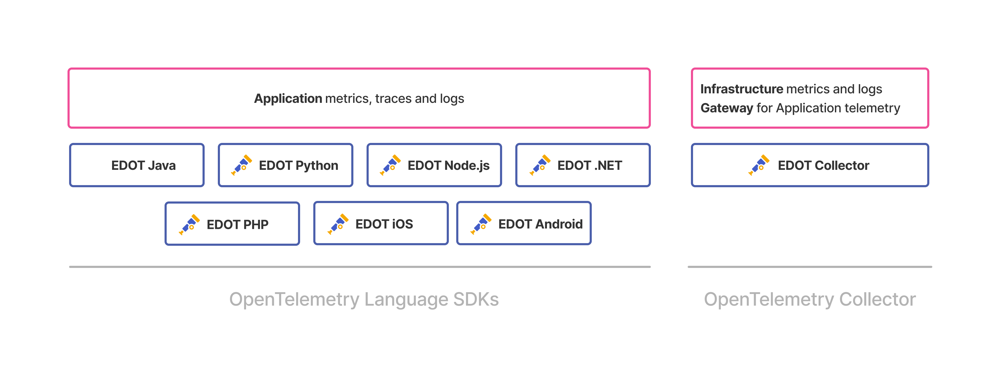

# Elastic Distributions of OpenTelemetry (EDOT)

Elastic Distributions of OpenTelemetry (EDOT) is an open-source ecosystem of [OpenTelemetry distributions](https://opentelemetry.io/docs/concepts/distributions/) tailored to Elastic. They include a customized OpenTelemetry Collector and several OpenTelemetry Language SDKs.

Each EDOT distribution is assembled with selected OpenTelemetry components and tested to ensure production readiness. This provides a reliable and optimized OpenTelemetry experience, enabling seamless adoption with confidence and expert support.

[OpenTelemetry](https://opentelemetry.io/docs/) is a vendor-neutral observability framework for collecting, processing, and exporting telemetry data. If you are new to OpenTelemetry, refer to OpenTelemetry [concepts](https://opentelemetry.io/docs/concepts/) and [components](https://opentelemetry.io/docs/concepts/components/). Refer to [EDOT compared to contrib Collector](/reference/compatibility/edot-vs-upstream.md) for more information on how EDOT differs from the contrib OpenTelemetry Collector.

## Available OpenTelemetry distributions

The following Elastic OpenTelemetry distributions are available:

| Distribution | Version | Status |
| ------------ | ------- | ------ |
| [EDOT Collector](elastic-agent://reference/edot-collector/index.md) | {{version.edot_collector}} | GA |
| [EDOT .NET](elastic-otel-dotnet://reference/edot-dotnet/index.md) | {{version.edot_dotnet}} | GA |
| [EDOT Java](elastic-otel-java://reference/edot-java/index.md) | {{version.edot_java}} | GA |
| [EDOT Node.js](elastic-otel-node://reference/edot-node/index.md) | {{version.edot_node}} | GA |
| [EDOT PHP](elastic-otel-php://reference/edot-php/index.md) | {{version.edot_php}} | GA |
| [EDOT Python](elastic-otel-python://reference/edot-python/index.md) | {{version.edot_python}} | GA |
| [EDOT Android](apm-agent-android://reference/edot-android/index.md) | {{version.edot_android}} | GA |
| [EDOT iOS](apm-agent-ios://reference/edot-ios/index.md) | {{version.edot_ios}} | GA |
| [EDOT Cloud Forwarder for AWS](/reference/edot-cloud-forwarder/aws.md) | {{version.edot_cf_aws}} | GA |

Each EDOT distribution undergoes production-grade testing before being declared Generally Available (GA). Elastic provides full support for GA releases in accordance with our [support matrix](https://www.elastic.co/support/matrix) and SLAs.

Technical Preview distributions receive best-effort support and are not covered under standard SLAs.

## Get started

Pick the right [Quickstart guide](docs-content://solutions/observability/get-started/opentelemetry/quickstart/index.md) for your environment or select an observability use case:

- [Monitoring on Kubernetes](docs-content://solutions/observability/get-started/opentelemetry/use-cases/kubernetes/index.md)
- [LLM Observability](docs-content://solutions/observability/get-started/opentelemetry/use-cases/llms/index.md)

## EDOT Demo environment

A demo environment that showcases EDOT capabilities is available in the [opentelemetry-demo repository](https://github.com/elastic/opentelemetry-demo).

The EDOT demo includes:

*   Sample applications instrumented with OpenTelemetry SDKs.
*   EDOT Collector configured for various scenarios. For example, Kubernetes and hosts.
*   Integration with an Elastic Stack deployment, such as {{es}} and {{kib}}.

Follow the instructions in the demo repository to set up and run the demo.

## Report an issue or provide feedback

To report an issue or provide feedback on EDOT, [submit a GitHub issue](https://github.com/elastic/opentelemetry/issues/new/choose).
