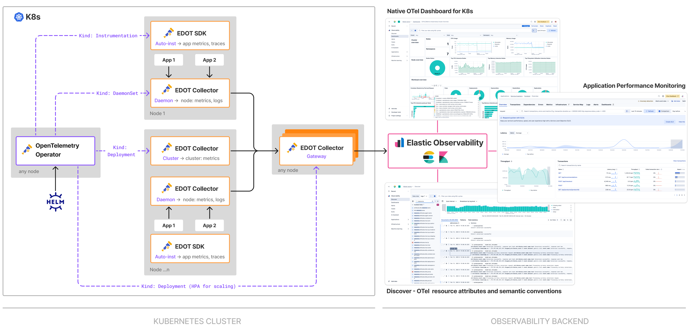

# Kubernetes observability with EDOT

The [quickstart guides](../../quickstart/index.md) for Kubernetes install a set of different EDOT Collectors and EDOT SDKs to cover collection of OpenTelemetry data for infrastructure monitoring, logs collection and application monitoring. This page provides more detailed description about the Kubernetes setup as well as guidance on how to customize the setup. 

The Kubernetes setup utilizes the OpenTelemetry Operator preconfigured to automate orchestration of EDOT as below:
 
* **EDOT Collector Cluster:** Collection of cluster metrics.
* **EDOT Collector Daemon:** Collection of node metrics, logs and application telemetry.
* **EDOT Collector Gateway:** Pre-processing, aggregation and ingestion of data into Elastic. 
* **EDOT SDKs**: Annotated applications will be auto-instrumented with [EDOT SDKs](../../edot-sdks/index.md).
  

This guide describes how to:

- Install the [OpenTelemetry Operator](https://github.com/open-telemetry/opentelemetry-operator/) using the [kube-stack Helm chart](https://github.com/open-telemetry/opentelemetry-helm-charts/tree/main/charts/opentelemetry-kube-stack).
- Use the EDOT Collectors to send Kubernetes logs, metrics, and application traces to an Elasticsearch cluster.
- Use the operator for applications [auto-instrumentation](https://opentelemetry.io/docs/kubernetes/operator/automatic/) in all supported languages.
