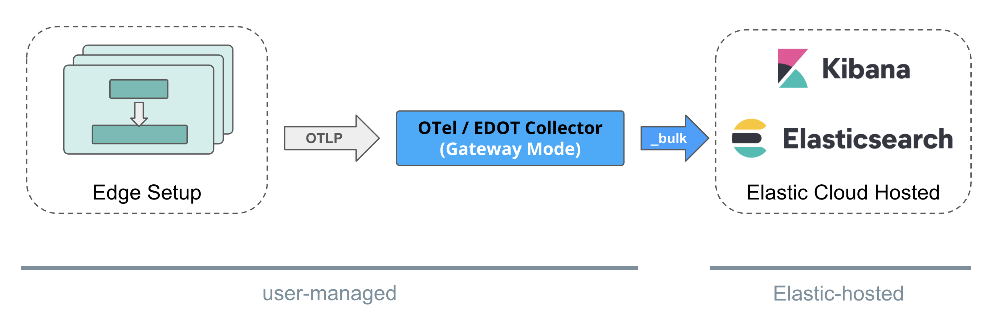

# Hosts / VMs Environments
{: .no_toc }

On host or virtual machine environments we recommend deploying local, per-host OpenTelemetry Collector instances (here referred to as OTel Collector in *Agent Mode*). 

These collectors have two main purposes:

1. The collection of local logs and infrastructure metrics. Refer to [this sample config file](https://raw.githubusercontent.com/elastic/elastic-agent/refs/tags/v{{ site.edot_versions.collector }}/internal/pkg/otel/samples/linux/managed_otlp/platformlogs_hostmetrics.yml) for recommended collector receiver configurations for hostmetrics and logs.
2. Enriching application telemetry (from OTel SDKs that run within the instrumented applications on corresponding hosts) with resource information.

{: .note}
> Though we recommend using EDOT SDKs and EDOT Collector in Agent mode in the edge setup (for supportability and enterprise feature reasons), it's not a technical requirement.
> Elastic's Observability solution is *technically compatible with edge setups that are fully based on upstream and vanilla OTel components*
> as long as the ingestion path follows the recommendations outlined in below sub-sections for the different Elastic deployment options.

Recommended architectures per Elastic deployment scenarios:

- TOC
{:toc}

## Elastic Cloud Serverless

Elastic Cloud Serverless provides a *managed OTLP endpoint* for ingestion of OpenTelemetry data. 

Users can send their OTel data from the [edge setup](#hosts--vms-environments) in OTel-native format through OTLP without any additional requirements for self-managed pre-processing of data.

## Elastic Cloud Hosted

As of Elastic Stack version {{ site.edot_versions.stack }} on *Elastic Cloud Hosted (ECH)*, users need to run a self-hosted EDOT Collector in *Gateway Mode* to ingest their OTel data from the [edge setup](#hosts--vms-environments) in OTel-native format into the Elastic-hosted Elasticsearch. 

The EDOT Collector in Gateway mode enriches and pre-aggrigates the data for a seamless experience in the Elastic Observability solution before ingesting it directly into Elasticsearch.

{: .note}
> 1. If required, users can build their custom, EDOT-like collector [following these instructions](../edot-collector/custom-collector#build-a-custom-edot-like-collector).
> 1. The EDOT Gateway Collector *does not* send data through Elastic's Integration / APM Server on ECH to ingest data into Elasticsearch.

{: .info}
> We are working on providing an Elastic-hosted OTel gateway solution for Elastic Cloud Hosted, that will eliminate the need for self-managing an EDOT Gateway Collector. Meanwhile, if self-managing an EDOT Gateway is not a valid option for you, refer to [Elastic's classic ingestion path for OTel data on ECH](https://www.elastic.co/guide/en/observability/current/apm-open-telemetry.html).

## Self-managed

In a self-managed deployment scenario, users need to host an EDOT Collector in Gateway mode that pre-processes and ingests OTel data from the [edge setup](#hosts--vms-environments) into the self-managed Elastic Stack.

{: .note}
> Compared to [Elastic's classic ingestion paths](https://www.elastic.co/guide/en/observability/current/apm-open-telemetry.html) for OTel data, with the EDOT Gateway Collector there is no need for an APM Server anymore.