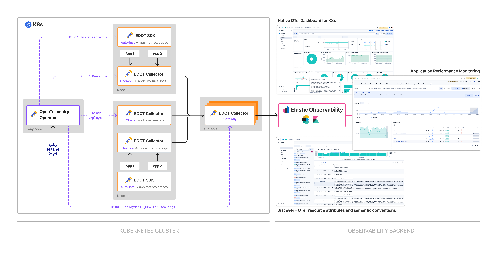

## 🚀 EDOT Quickstart Guide
This guide helps you set up Elastic Distributions for OpenTelemetry (EDOT) to monitor Kubernetes, applications, and hosts. It covers installing the EDOT Collector, enabling auto-instrumentation, and configuring data collection for metrics, logs, and traces in Elastic Observability. 

> 🏁 *By the end of this guide, you’ll have a fully operational EDOT-powered monitoring pipeline sending data to Elastic Observability.*

### 📖 Guide content
* Infrastructure & Application Monitoring
  * [Kubernetes](#)

* Hosts Monitoring and Log collection
  * [Linux](#linux)
  * [Mac](#macos)
  * [Windows](#windows)

###  ☸️ Kubernetes - Infrastructure & Application  Monitoring
These instructions will install an OpenTelemetry Operator preconfigured to automate orchestration of EDOT as below:
 
 * **EDOT Collector Cluster:** Collect cluster metrics
 * **EDOT Collector Daemon:** Collect node metrics and logs
 * **EDOT Collector Gateway:** perform APM pre-processing (when applicable). Route all telemetry to Elastic,  
* **EDOT SDKs**: Annotated applications will be auto-instrumented with EDOT SDKs
  

#### 1. Kubernetes Infrastructure Metrics and Log Collection
Add the OpenTelemetry repository to Helm:
```
helm repo add open-telemetry 'https://open-telemetry.github.io/opentelemetry-helm-charts' --force-update
```
Retrieve your [Elasticsearch endpoint](https://www.elastic.co/guide/en/kibana/current/search-space-connection-details.html) and [API key](https://www.elastic.co/guide/en/kibana/current/api-keys.html) and replace both in the below command to create a namespace and a secret with your credentials.
```bash
kubectl create namespace opentelemetry-operator-system
kubectl create secret generic elastic-secret-otel \
  --namespace opentelemetry-operator-system \
  --from-literal=elastic_endpoint='<ELASTICSEARCH_ENDPOINT>' \
  --from-literal=elastic_api_key='<BASE64_APIKEY>'
```
Install the OpenTelemetry Operator using the kube-stack Helm chart with our pre-configured `values.yaml` file that will indicate to the operator how to orchestrate and configure EDOT. 
```bash
helm install opentelemetry-kube-stack open-telemetry/opentelemetry-kube-stack \
  --namespace opentelemetry-operator-system \
  --values 'https://raw.githubusercontent.com/elastic/elastic-agent/51942e903eb69bb295920763b10a1c8bec68d1e8/deploy/helm/edot-collector/kube-stack/values.yaml' \
  --version '0.3.9'
```
##### Install cert-manager (recommended)
For automatic certificate renewal, we recommend installing [cert-manager](https://cert-manager.io/docs/installation/), and customize the `values.yaml` file before the installation as described in [this section](https://github.com/elastic/opentelemetry/tree/8.16/docs/kubernetes/operator#cert-manager).

##### Change Log Collection Configuration (optional)
New log messages are collected from the setup onward.
The default log path is `/var/log/*`. You can change this or include other paths in the EDOT collector configuration, for advanced settings visit [filelog receiver documentation.](https://github.com/open-telemetry/opentelemetry-collector-contrib/tree/main/receiver/filelogreceiver)

To edit settings change the below section in the Helm `values.yml` file: 
```yaml
        filelog:
          retry_on_failure:
            enabled: true
          start_at: end
          exclude:
            # exlude collector logs
            - /var/log/pods/*opentelemetry-kube-stack*/*/*.log
          include:
            - /var/log/pods/*/*/*.log
          include_file_name: false
          include_file_path: true
          operators:
            - id: container-parser # Extract container's metadata
              type: container
```
#### 2. Kubernetes Application Monitoring (optional)
The following languages are currently supported for auto-instrumentation: Node.js, Java, Python, .NET and Go. 

Choose the annotation method that best suits your needs and apply the instructions for the corresponding language:

**Annotate a specific Deployment**
Add a language-specific annotation to your Kubernetes Deployment manifest and restart your deployment. Replace 'LANGUAGE' with one of the supported values: `nodejs`, `java`, `python`, `dotnet` or `go`  
```yaml
apiVersion: apps/v1
kind: Deployment
metadata:
  name: myapp
spec:
  ...
  template:
    metadata:
      annotations:
        instrumentation.opentelemetry.io/inject-'LANGUAGE': "opentelemetry-operator-system/elastic-instrumentation"
      ...
    spec:
      containers:
      - image: myapplication-image
        name: app
      ...
```
**Annotate all resources in a namespace**
Add a language-specific annotation to your namespace by replacing 'LANGUAGE' with one of the supported values: `nodejs`, `java`, `python`, `dotnet` or `go` in the below command. 
```
kubectl annotate namespace my-namespace instrumentation.opentelemetry.io/inject-nodejs="opentelemetry-operator-system/elastic-instrumentation"
```
For both methods, Restart deployment and ensure the annotations are applied and the auto-instrumentation library is injected.

For languages where auto-instrumentation is not available, visit [this page](https://ela.st/8-16-otel-apm-instrumentation)

### 🖥️ Hosts Monitoring and Log collection
These instructions guide you through setting up the EDOT Collector to collect host metrics and logs using an OpenTelemetry configuration. You’ll download the appropriate package for your system, configure authentication, and run the collector. Optional steps allow you to customize log collection paths and set up application monitoring.

#### 1. Run EDOT Collector for Host Metrics and Log collection
These instructions will download EDOT collector including an OpenTelemetry collector configuration that will:

* Collect metrics from your host 
* Collect logs from a set of locations in your host
Run the below commands to download the EDOT Collector package relevant to your system's architecture. 

**Linux**
Download EDOT Collector
```bash
arch=$(if ([[ $(arch) == "arm" || $(arch) == "aarch64" ]]); then echo "arm64"; else echo $(arch); fi)

curl --output elastic-distro-8.17.2-linux-$arch.tar.gz --url https://artifacts.elastic.co/downloads/beats/elastic-agent/elastic-agent-8.17.2-linux-$arch.tar.gz --proto '=https' --tlsv1.2 -fOL && mkdir -p elastic-distro-8.17.2-linux-$arch && tar -xvf elastic-distro-8.17.2-linux-$arch.tar.gz -C "elastic-distro-8.17.2-linux-$arch" --strip-components=1 && cd elastic-distro-8.17.2-linux-$arch
```
Replace the collector configuration with a preset for logs and host metrics collection and inject your credentials into the EDOT collector default configuration. 

Retrieve your [Elasticsearch endpoint](https://www.elastic.co/guide/en/kibana/current/search-space-connection-details.html) and [API key](https://www.elastic.co/guide/en/kibana/current/api-keys.html) and replace `<ELASTICSEARCH_ENDPOINT>` and `<BASE64_APIKEY>` before applying the below command.
```bash
rm ./otel.yml && cp ./otel_samples/platformlogs_hostmetrics.yml ./otel.yml && mkdir -p ./data/otelcol && sed -i 's#\${env:STORAGE_DIR}#'"$PWD"/data/otelcol'#g' ./otel.yml && sed -i 's#\${env:ELASTIC_ENDPOINT}#<ELASTICSEARCH_ENDPOINT>' ./otel.yml && sed -i 's/\${env:ELASTIC_API_KEY}/<BASE64_APIKEY>/g' ./otel.yml
```
Run EDOT collector
```bash
sudo ./otelcol --config otel.yml
```
##### MacOS
Download EDOT Collector
```bash
arch=$(if ([[ $(arch) == "arm" || $(arch) == "aarch64" ]]); then echo "arm64"; else echo $(arch); fi)

curl --output elastic-distro-8.17.2-darwin-$arch.tar.gz --url https://artifacts.elastic.co/downloads/beats/elastic-agent/elastic-agent-8.17.2-darwin-$arch.tar.gz --proto '=https' --tlsv1.2 -fOL && mkdir -p "elastic-distro-8.17.2-darwin-$arch" && tar -xvf elastic-distro-8.17.2-darwin-$arch.tar.gz -C "elastic-distro-8.17.2-darwin-$arch" --strip-components=1 && cd elastic-distro-8.17.2-darwin-$arch
```
Replace the collector configuration with a preset for logs and host metrics collection and inject your credentials into the EDOT collector default configuration. 

Retrieve your [Elasticsearch endpoint](https://www.elastic.co/guide/en/kibana/current/search-space-connection-details.html) and [API key](https://www.elastic.co/guide/en/kibana/current/api-keys.html) and replace `<ELASTICSEARCH_ENDPOINT>` and `<BASE64_APIKEY>` before applying the below command.
```bash
rm ./otel.yml && cp ./otel_samples/platformlogs_hostmetrics.yml ./otel.yml && mkdir -p ./data/otelcol && sed -i 's#\${env:STORAGE_DIR}#'"$PWD"/data/otelcol'#g' ./otel.yml && sed -i 's#\${env:ELASTIC_ENDPOINT}#<ELASTICSEARCH_ENDPOINT>' ./otel.yml && sed -i 's/\${env:ELASTIC_API_KEY}/<BASE64_APIKEY>/g' ./otel.yml
```
Run EDOT collector
```bash
sudo ./otelcol --config otel.yml
```
**Windows**
Download EDOT Collector
```# Download and extract
$distroPath = "elastic-distro-8.17.2-windows-x86_64";$zipFile = "$distroPath.zip"
```
This step disables the progress bar which might slow down the download
```bash
$ProgressPreference = 'SilentlyContinue';Invoke-WebRequest -Uri "https://artifacts.elastic.co/downloads/beats/elastic-agent/elastic-agent-> 8.17.2-windows-x86_64.zip" -OutFile $zipFile;
New-Item -ItemType Directory -Force -Path $distroPath | Out-Null
Expand-Archive -Path $zipFile -DestinationPath $distroPath
Move-Item -Path "$distroPath\elastic-agent-8.17.2-windows-x86_64\*" -Destination $distroPath
Remove-Item -Path "$distroPath\elastic-agent-8.17.2-windows-x86_64" -Recurse
Remove-Item -Path $zipFile
Set-Location $distroPath
```
This command replaces the collector configuration with a preset for logs and host metrics collection
```bash
Remove-Item -Path .\otel.yml -ErrorAction SilentlyContinue
Copy-Item .\otel_samples\platformlogs_hostmetrics.yml .\otel.yml
New-Item -ItemType Directory -Force -Path .\data\otelcol | Out-Null
```
Replace environment variables in otel.yml
```bash
$content = Get-Content .\otel.yml
$content = $content -replace '\${env:STORAGE_DIR}', "$PWD\data\otelcol"
$content = $content -replace '\${env:ELASTIC_ENDPOINT}', "https://sample.eu-west-1.aws.qa.cld.elstc.co:443"
$content = $content -replace '\${env:ELASTIC_API_KEY}', "sampleApiKey=="
$content | Set-Content .\otel.yml
```
#### 2. Change Log Collection Configuration (optional)
New log messages are collected from the setup onward.
The default log path is `/var/log/*`. You can change this or include other paths in the EDOT collector configuration, for advanced settings visit [filelog receiver documentation.](https://github.com/open-telemetry/opentelemetry-collector-contrib/tree/main/receiver/filelogreceiver)

To change log collection settings edit the below section of the `otel.yml` collector configuration file.
```yaml
receivers:
  # Receiver for platform specific log files
  filelog/platformlogs:
    include: [ /var/log/*.log ]
    retry_on_failure:
      enabled: true
    start_at: end
    storage: file_storage
```

### Troubleshooting
- [EDOT Collector Troubleshooting](docs/EDOT-collector/edot-collector-troubleshoot.md)
- [Auto-instrumentation Troubleshooting](docs/kubernetes/operator/troubleshoot-auto-instrumentation.md).
